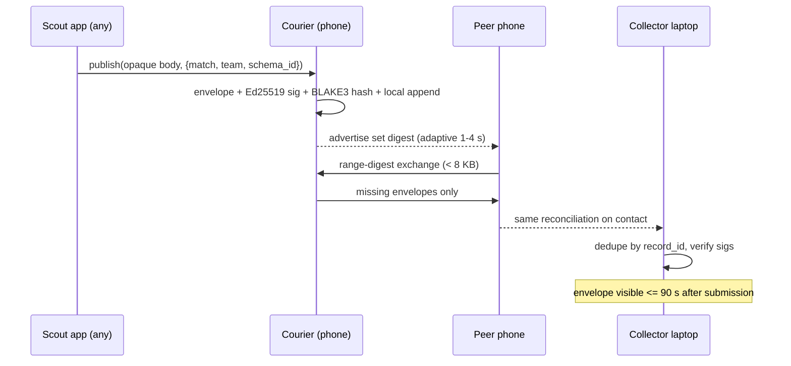
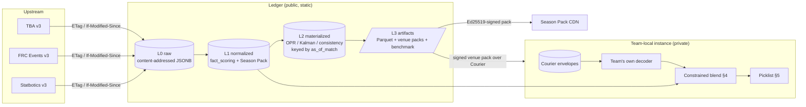
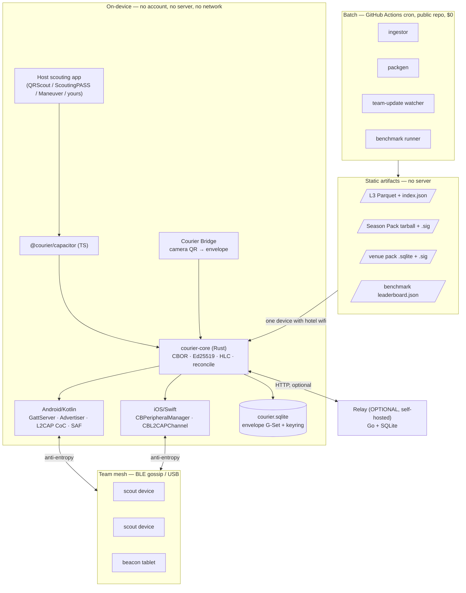
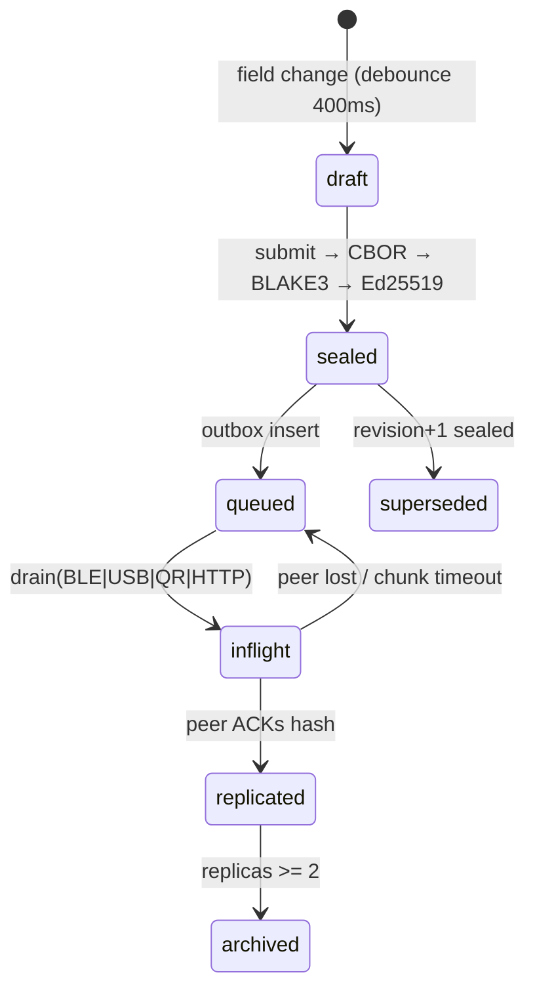
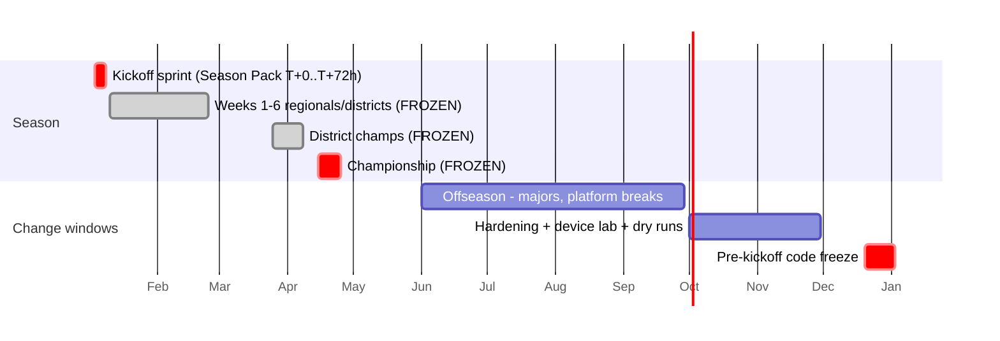

# Courier · Season Pack · Ledger

**A design document for three pieces of FIRST Robotics Competition software that should exist and don't.**

Version 0.1 (draft for review) · 2026-08-07

---

## What this is

An engineering design document for three FRC tools, grounded in a research pass over what the FRC community actually says is missing. It covers product definition, the data spine, backend and protocol design, frontend architecture, and the security, privacy, operations and governance story.

It is a **draft for review, not an approved plan.** It has been through one adversarial review, whose verdict was "not buildable as written — the thesis is right, the scope is roughly 4× what the named team can carry." That review is included in full as [docs/CRITIQUE.md](docs/CRITIQUE.md), and its conclusions are binding on §0 below. Read §0 before you read anything else, because it overrides the sections where they disagree.

**How it was made.** Seven parallel research agents swept Chief Delphi, Reddit, GitHub, the FRC Events and Blue Alliance API docs, Statbotics, and team blogs. Each lane's findings then went to an independent fact-checker instructed to load every cited URL and kill anything it could not corroborate — 73 gaps survived, and a significant number were refuted or downgraded. A strategy pass clustered the survivors into products and produced the constraint list. Five section authors drafted against that research. A final adversarial reviewer checked the assembled document against the sources and against itself.

Supporting material:

| File | What's in it |
|---|---|
| [docs/RESEARCH-FINDINGS.md](docs/RESEARCH-FINDINGS.md) | All 73 corroborated gaps, with citations and a "why nobody built it" for each |
| [docs/CONSTRAINTS.md](docs/CONSTRAINTS.md) | The 22 constraints any FRC tool must respect. Useful on its own. |
| [docs/NOT-BUILDING.md](docs/NOT-BUILDING.md) | 21 deliberately rejected ideas and the evidence for rejecting them |
| [docs/CRITIQUE.md](docs/CRITIQUE.md) | The full adversarial review: 39 defects, 5 required additions, and the verdict |
| [docs/STRATEGY.md](docs/STRATEGY.md) | The product-selection pass: impact/feasibility scoring, the rejected set, and the 22 constraints in raw form |

---

## The thesis

**The FRC community does not have a scouting problem. It has a transport, schema, and archive problem wrapped inside a scouting problem it is deliberately choosing not to solve.**

The evidence that kills the obvious product: `maneuver-core` is a year-agnostic scouting framework with offline PWA support, QR transfer, and peer-to-peer sync. It is free, open source, actively maintained, and solves the exact problem a dozen teams re-solved in 2026. It has **2 stars, 4 forks, and 1 watcher.** The most-starred project in the whole lane is ScoutingPASS at 77 stars, against ~3,500 teams.

That is not a distribution failure — it is revealed preference. Mentors use app-building as curriculum. Teams treat divergent data as competitive advantage. The top reply to "why isn't there a universal scouting app" is the xkcd *Standards* comic. Any product pitched as *stop building your own* is asking customers to give up the thing they were buying.

So: **build the layers beneath the rebuild** — the parts every rebuilder needs, none of which are pedagogically interesting, all of which are cross-platform maintenance labor no single student maintainer can carry.

| | What it is | Why it's unclaimed |
|---|---|---|
| **Courier** | App-agnostic offline data transport. Native BLE + USB, shipped as a plugin any scouting app can adopt *and* a standalone bridge that ingests the QR output of apps that adopt nothing. Standardizes the envelope, never the body. | Game Manual **E301** bans team-created 802.11 venue-wide, killing every "just run a LAN" design. Bluetooth is legal (**R905** scopes only the operator console) — but Web Bluetooth has no peripheral role and doesn't exist in iOS Safari, so every solo dev who chose a PWA hit a wall. The native cross-platform burden *is* the moat. |
| **Season Pack** | Versioned, machine-readable game/scoring schema published at kickoff and re-published on Team Updates: units, additivity, per-robot vs alliance attribution, RP thresholds. | A GitHub search for such a package returns `total_count: 0`. TBA hand-maintains 21 per-season Python files; Statbotics surrenders interpretability to generic `comp_N` columns; Cheesy Arena ships current-game scoring 4–5 months late every year without exception. |
| **Ledger** | Free, current, account-free bulk data; signed offline venue packs; and the first public benchmark scoring rating models on *picklist ranking quality* rather than match prediction alone. | TBA's advertised bulk archives stop at 2019 while the docs still point at them; the only live bulk path needs a Google Cloud billing account. No offline EPA mirror exists. Nobody measures top-8 ranking quality — Statbotics' own evaluation page has no Spearman, no Kendall, no top-8 metric. |

Underneath all three sits the clause that determines everything: FIRST's Terms of Use prohibit "any commercial use (i.e. use that generates revenue) of the APIs, API Documentation or Events Data." **There is no business model. There never will be.** Every design must degrade to *a file on disk*, not *a service that is up* — and every credential belongs to someone who graduates within four years.

---

## §0 · Normative decisions and corrections

The five sections that follow were drafted in parallel and **contradict each other in places.** This section is the single source of truth. Where a section disagrees with a decision here, this section wins. Nothing should be implemented until D-1 through D-8 are settled in code.

### D · Design decisions that override the sections

| # | Decision | Overrides |
|---|---|---|
| **D-1** | **One wire format.** The CDDL in Backend §3.1 is normative. The envelope descriptions in Product FR-1, Frontend §2.2, and SecOps §3 are illustrative only and must be regenerated from it. Publish the CDDL as a versioned in-repo file before any code is written. | Four incompatible envelope definitions across four sections |
| **D-2** | **Dedup key is `record_id` = BLAKE3(canonical CBOR of the whole record)** — never the body hash. Body-hash dedup silently discards the deliberate 10% double-scouting that the analytics layer's identifiability depends on, because two scouts watching the same robot in a quiet match routinely produce byte-identical bodies. `bh` remains an integrity field only. Envelope rows are append-only; an edit writes a new record superseding the old, never `put()` over it. | Product FR-2; Frontend §2.2 Dexie primary key and `enqueue` |
| **D-3** | **Set reconciliation is hierarchical range digests** (Backend §3.5). IBLT is rejected — sizing it requires estimating the symmetric difference in advance. FR-4 is restated as an outcome: *converge in ≤2 round-trips and ≤8 KB for a 50-envelope symmetric difference.* | Product FR-4 and journey (a)'s sequence diagram |
| **D-4** | **The decoder seam is named, not hidden.** Courier bodies are opaque, but every analytics feature consumes *decoded* values, and no section said where a decoder comes from. Decision: ship `@courier/decode`, a reference decoder generated from the same JSON Schema the form engine emits, resolved by `schema_id` through a registry. **A team with no registered decoder gets transport and envelope metadata only** — Ledger, the constrained blend, the scout-reliability detectors, and the uncertainty charts all degrade to official data only, and the UI says so. This is the seam between "transport nobody has to agree on" and "analytics that require agreement." | Nothing designed it; the largest hand-wave in the draft |
| **D-5** | **Offline official results have an explicit path.** Saturday's FMS alliance totals cannot reach a pit with no uplink, which makes the constrained blend inoperative exactly when the picklist is built. Decision: one designated runner leaves the venue hourly with a phone on cellular and re-injects a signed `courier.results.v1` payload into the mesh. **Until it arrives the blend runs unconstrained** (prior + scouts only) and the staleness banner shows `official_totals_as_of_match`. | Product journey (c); Data §4; Frontend §10 |
| **D-6** | **Pseudonyms are minted at seal time, not rewritten at egress.** `sid_event = BLAKE3(sid ‖ event_key ‖ mesh_key)` goes into the signed record from the start; the raw `scout_id` lives in a per-mesh side table outside the signature. Egress rewriting is mathematically impossible — it invalidates the signature and changes `record_id`. | SecOps §1 |
| **D-7** | **Encrypted bodies hash their ciphertext.** With `bh` = plaintext hash shipping in the clear beside an encrypted body, anyone can confirm a guess against a tiny plaintext space — a total break. When `enc ≠ 0`, `bh` is the ciphertext hash. Consequence, accepted: cross-app dedup in the Bridge is impossible for encrypted envelopes. | Backend §5 |
| **D-8** | **No sequence-number replay defense.** A high-water-mark rule is fatal in epidemic gossip, where out-of-order arrival is normal — a device hearing match 60 before 55 would drop 55 permanently, falsifying the convergence claim. Replay of a signed record into a grow-only set is already idempotent. | SecOps §2 T7 |
| **D-9** | **USB is mass-storage sneakernet, not tethering.** USB tethering is deleted: on iOS it raises the Wi-Fi AP unless the user manually disables it — shipping an E301 violation as a side effect — it needs a cellular plan on most Android builds, and two phones cannot tether to each other. Sneakernet is what 3128 actually retreated to and has no rules surface at all. | Backend §3.4; SecOps §4 C2 |
| **D-10** | **Keys are hardware-backed where the platform provides it, software-backed otherwise, and the envelope records which.** A non-exportable keystore key is impossible on the ChromeOS/web target, where an AUE'd Chromebook has no WebCrypto Ed25519 at all. Also: **sign the canonical record, not the body bytes** — signing only the body leaves `event_key`, `match`, `team`, `scout_id` and `schema_id` freely tamperable. | Product FR-3; Frontend §2.3 |
| **D-11** | **One gossip schedule: anti-entropy every 20 s, fanout 3.** The 45 s / fanout-2 schedule yields ~180 s propagation against a 90 s requirement, and the frontend's 90 s drain timer consumes the entire budget on the first attempt. Battery figures in NFR-1 must be re-derived from this schedule. | NFR-2; Backend §3.3; Frontend §2.3 |
| **D-12** | **One throughput table, all cells marked estimated.** Four different BLE numbers appear across the draft, one labelled "measured" when nothing was measured. Every NFR derived from throughput references that one table. iOS `updateValue` backpressure — where the second and subsequent notifications return `false` and the ready-callback stalls 50–100 ms — is the real determinant of iOS throughput and must be modelled as a named risk. | NFR-3/NFR-4; Backend §3.3; SecOps C3 |
| **D-13** | **L2CAP CoC is cut from v1.** The stated justification (no ATT overhead) is wrong — ATT overhead with DLE is ~1.2% — and the section's own conclusion is that bandwidth is not the constraint. A second full transport state machine on two platforms is exactly the cross-platform maintenance labor that killed every predecessor. Revisit in v2 behind a measured requirement. | Backend §3.3 |
| **D-14** | **One hosting topology, one cost table, in Backend §8.** The CDN domain is **primary** for artifacts and GitHub is the **mirror** — not the reverse — because the document's own constraint 17 and its own runbook both note that school districts block GitHub. | Backend §8; SecOps §8; NFR-8 |
| **D-15** | **One plugin surface, genuinely small: `Courier.publish(meta, bytes)` plus one `<OutboxPill/>`.** The Dexie schema, drain loop, backoff table and service worker live entirely inside the plugin and are invisible to the host app. The ≤30-line QRScout fork is the single most load-bearing acceptance test in the document and must actually be written in v0. | Product FR-7; Frontend §2–§3 |
| **D-16** | **One pairing ceremony**, normative in Backend §3.2, covering both key types and the Ed25519→X25519 derivation if both are needed. Three mutually exclusive schemes currently appear across three sections. | Product FR-10; Backend §3.2; SecOps §2 T1 |
| **D-17** | **Season Pack has two separately-measured commitments**, not one deadline stated two ways six weeks apart: **`1.0.0` (manual-derived) at kickoff+72 h** and **`1.1.0` (FMS-bound) at first-breakdown+48 h**, each with its own SLO and its own kill criterion. | Product FR-15/§7; SecOps §5/§11 |
| **D-18** | **Release signing: 1-of-2 for MINOR and PATCH, 2-of-2 for MAJOR.** A 2-of-N threshold will miss the 72-hour kickoff sprint the first time a signer is on a plane. | Product FR-19; Backend §6; Data §3 |
| **D-19** | **Export is envelope metadata as CSV and bodies as length-prefixed raw.** Exporting opaque bodies "to CSV matching each source app's importer" would require Courier to parse them — the exact coupling the opacity thesis exists to avoid. Per-app import formats are the Bridge's `bridge_profiles.json` problem. | Product FR-9 vs FR-1 |
| **D-20** | **Cut from v1:** the `photo` widget (either useless offline or a compliance hazard — camera captures from minors' phones inside an opaque body), the `scout_roster` name-mapping table (ship `scout_id` plus a non-name label; perceived PII exposure is what barred California teams), Pack Studio (a drag-and-drop form authoring SPA is half a scouting app, contradicting the thesis), and the 28-component design system. | Frontend §4, §9; SecOps §1 |
| **D-21** | **One battery gate: one device, one duration, split into transport-overhead and screen-on components.** Three incompatible ceilings currently exist — 350 mWh over 12 h on a Pixel 6a, ≤6%/hr screen-on, and ≤22% over 8 h on an iPhone SE (2020), which is ~4.4× the first. Adopt the Pixel 6a / full-competition-day gate and delete the other two. **This number must be re-derived after D-11**, because 3 connection attempts per 20 s round at ~1.8 s setup each is roughly 27% radio duty on setup alone — the existing figure was computed for 1 s advertising and no sync bursts, and is likely wrong by an order of magnitude. |
| **D-22** | **One memory budget per route, and the venue pack streams.** NFR-6's ≤120 MB and Frontend §5's ≤320 MB cannot both hold, and loading a 12–40 MB SQLite into `sql.js` MEMFS puts the whole file resident in the wasm heap on a 2–3 GB device — the same objection used to reject DuckDB-WASM. Split the pack: a small L2 summary for the venue route, the full pack for the laptop. Measure before committing to any number. |
| **D-23** | **"No PKI" cuts the apparatus, not the signature.** Per-device Ed25519 envelope signing **survives** into v1 — D-1's COSE_Sign1, D-2's `record_id`, D-6's `sid_event` and D-10's key backing all depend on it. What the scope verdict cuts is the keyring operations, epochs, transparency log, threshold stewards, and the Shamir-split root: a trust hierarchy for ≤12 devices belonging to one high-school club. |
| **D-24** | **The v1 wire format is the CDDL minus `hlc` and `enc`, and v1 has no link encryption.** Cutting HLC changes `record_id`, the envelope size arithmetic, the advertising payload, and the bundle filename — and removes the `?since={hlc}` sync cursor, which is replaced by the range-digest root of D-3. On link security, say it plainly rather than leaving it undefined once L2CAP is cut (D-13): **v1 integrity is the envelope signature; v1 confidentiality is none, accepted.** Noise `XK` returns with L2CAP in v2. |
| **D-25** | **Analysis reads the current view of the store; sync reads the log.** The record set is append-only, and it must stay that way — a peer that has not yet seen a correction still needs the original to reconcile against. But averaging that set counts a scout who fixed a slipped keystroke twice, once at the wrong value and once at the right one, and both numbers are individually plausible so nothing downstream catches it. `RecordStore.currentRecords()` (one record per scout per observation, superseded revisions removed, ordered identically on any two devices holding the same records) is the ONLY input any estimator may take. Every consumer prints how many revisions were excluded rather than applying the filter silently. |
| **D-26** | **Scout reliability has an offline reference, and it measures disagreement rather than accuracy.** D-5's blend needs an official total, which arrives after the matches that mattered; a scout who stopped watching must be found on Saturday morning. Decision: residuals come from **leave-one-out peer consensus** within one (event, match, team). Leave-one-out is normative — a mean including the scout shrinks every residual by 1/n. Two consequences must be stated in every surface that shows the output: two scouts watching the same wrong robot agree perfectly and both score reliable, and a pair who only ever watch together cannot be separated at all because nothing breaks the symmetry. A team that never double-scouts gets an explanation of the tradeoff, never a table of zeros. |
| **D-27** | **Peer residuals are fitted before they are judged.** With two scouts on a robot the two residuals are exact negatives, so one person drifting low is an equal and opposite "drift" in whoever sat beside them — running a detector on raw residuals accuses every honest partner of the one careless scout. Normative: fit an additive effect per scout across all their pairings (ridge least squares, centred so the effects sum to zero) and subtract the PEERS' fitted effects before any bias estimate or drift alarm. |
| **D-28** | **CUSUM constants are k = 0.75, h = 5, and they are measured.** §2 D5 specifies the textbook k = 0.5σ / h = 4σ. That pairing gives a **23% chance of falsely accusing any given clean scout** over the ~48 paired observations of one two-day event — an 81% chance of accusing somebody innocent on a six-scout team, at every event. The textbook in-control run length of ~168 is not wrong; it answers a different question, because teams run their scouts in parallel and care about the chance that *any* of them is flagged *once*. At 0.75 / 5 that falls to 1.0% per scout and 6% across a team of six, while a 1.5σ or worse drift is still caught essentially every time. Accepted cost: about a fifth of mild 1σ drifts are missed. `packages/analytics/bench/cusum-operating-point.ts` reproduces the table; do not change these without re-running it. | §2 D5's "k = 0.5σ, h = 4σ, 4–6 matches" |

### C · Factual corrections

Each of these was wrong in the draft and is corrected here. Several are the kind of error a Chief Delphi reader checks in ten seconds, which is why they matter more than their size suggests.

| # | Was | Is |
|---|---|---|
| **C-1** | "Statbotics returned 500s for ~4 weeks (2026-06-13 to 2026-07-11)" | **Two independent, still-unanswered full-outage reports** — issue #414 (2026-06-15) and #418 (2026-07-18) — with the API healthy at time of writing. The honest claim is *unattended failure*, not sustained downtime, and it is the stronger argument: nobody answered either ticket. Corrected in three places. |
| **C-2** | 2027 kickoff sprint at 01-03, Week 1 events at 01-10 | **2027 kickoff is January 9.** Week 1 cannot be one day later; with a ~6.5-week build season it lands in **late February**. Every freeze window in the operational plan was misaligned by ~6 weeks and must be rebuilt from the published calendar. |
| **C-3** | "400 devices at 1 Hz consume >100% of advertising channel time" | **≈15% per-channel occupancy.** A 31-byte legacy advertising PDU is 376 µs at 1M PHY, sent once per channel on three *separate* channels: 400 × 376 µs = 150 ms/s. Adaptive backoff is still worth having, but must be justified on collision probability and scanner-side connection storms — not this number. |
| **C-4** | Chromebook floor "Chrome ~91" | The named Acer C731 reached AUE in **June 2022, freezing near Chrome 102.** Chrome 91 is 2014–15 hardware. Conservative, so nothing breaks — but it means paying polyfill weight for a floor that doesn't exist, and it understates the real issue: the flagship rookie persona runs an unpatched browser four years past security support, which is where key material lives. |
| **C-5** | "$99/year Apple fee, unavoidable" | **Waivable.** Apple waives the Developer Program fee for nonprofits, accredited educational institutions, and government entities distributing only free apps. Being barred from revenue by FIRST's ToU satisfies the free-apps condition — but the waiver also requires an **eligible legal entity**, so this qualifies only once such an entity holds the account. An accredited school district, the entity every FRC team already sits inside, is the obvious candidate. Recurring cost target is **$0**; the fee-waiver application becomes a P0 governance task. |
| **C-6** | Offseason field tests "IRI, Chezy Champs, Battle of the Bay, Sept–Nov" | **IRI runs in mid-July** and has already passed relative to this document's date. Drop it. |
| **C-7** | COSE protected header `{6: uint}` annotated `iat` | Label 6 is **`Partial IV`** (a `bstr`) in the COSE header registry — countersignature is label 7/11. `iat` is claim key 6 in the *CWT claims* registry, a different namespace. A `{6: uint}` header therefore also collides with Partial IV's type. A strict implementation will reject or misread this. Move `iat` into the payload — `ts` and `hlc` already make it redundant. |
| **C-8** | Alliance red `#B3123B` on surface `#0E1116` | **2.76:1 — fails WCAG 1.4.11's 3:1 minimum** for non-text UI, in a section claiming AAA. The red-vs-blue *separation* math (3.78:1) was correct; red-vs-*background* was never computed. Re-solve both constraints jointly, or mandate a 2 px border on every red badge. Add fill-vs-surface to the CI contrast matrix. |
| **C-9** | E301 cited as banning "WiFi of any kind, venue-wide" | E301 bans teams **setting up their own** 802.11. It does not ban using a venue-provided network or cellular. Not depending on those is a defensible *product choice* (venue uplinks saturate), but it is not a rules constraint, and the document's credibility rests on rules accuracy. |
| **C-10** | E302 never analyzed | **E302 is the rule that actually bites the cross-team relay**: participants may not attempt to connect with another team's wireless communication except as expressly allowed. A plain reading covers the opt-in relay. It must appear in the compliance table, the rules memo, and the FTA review — and that review must happen before P0 ends, not before v1. |
| **C-11** | Capacitor 7 (backend) vs Capacitor 8 (frontend) | **Capacitor 8, pinned, everywhere.** Add a policy that major upgrades happen only in June–August, and put it in the freeze table — Capacitor 9 is due mid-2027, inside the freeze window. |

### Requirements with no design, and machinery with no requirement

Two lists that must be reconciled before v1 scope is frozen. **Promised but designed nowhere:** the drive coach's pre-match briefing (a named persona's core job, with no surface and no data path), the scouting lead's per-scout completeness report, and the Week-0 organizer's scoring engine (v2, so that persona gets nothing in v1 — say so). **Most importantly, the rookie persona is served worst by the architecture:** ChromeOS is central-only, so a rookie with only borrowed Chromebooks cannot form a mesh at all, needs OTG adapters they don't have, and cannot install a Capacitor app on a district-managed device without admin allowlisting. That install path is a first-class deliverable, not a footnote.

**Built for no requirement, and therefore cut or deferred:** L2CAP CoC (D-13), the 16-byte HLC (`rev` already orders edits and `record_id` breaks ties for free), `enc: 2` (exists only for a relay that may not ship), and the full keyring PKI with epochs, transparency log and Shamir 3-of-5 — a trust hierarchy for ≤12 devices belonging to one high-school club whose realistic adversary retreated to USB flash drives last June.

### The scope verdict

The reviewer's judgement, adopted here: **the thesis is right and the build plan is roughly 4× what a volunteer team can carry.** The draft proposes a Rust protocol core with three binding targets, cross-platform native BLE including a peripheral role, a threshold-signature PKI, a Go relay and CLI, a Python/DuckDB pipeline, a 24-year archive, a novel rating model, a novel draft simulator, a benchmark, five frontend surfaces, a design system, a form-authoring studio, and an annual 72-hour schema sprint that must never miss. That is larger than The Blue Alliance, which has four trustees.

It does not die on adoption — the adopt-nothing Bridge is a genuinely good answer to that. **It dies in January 2028**, when the schema sprint, the Team Update watcher, four bridge-profile updates and a form-generator update all come due inside the six-week build season, staffed by volunteers who were founding seniors in year one and are freshmen in year two inheriting a Rust/Kotlin/Swift/Go/Python/TypeScript codebase they cannot debug. The document identifies this failure mode and then writes "one miss is terminal."

**Recommended v1.** Note carefully: the phase tables, success metrics, and milestone lists in §1.7, §1.8 and §5.11 **predate this verdict and are superseded by it** — they still schedule iOS, the published plugin, venue packs, the rating model and the benchmark. They have not been rebuilt. Do not read them as commitments until they are.

- **Courier Bridge only** — QR ingest via `bridge_profiles.json`, one envelope format, BLE GATT gossip with range digests, USB mass-storage sneakernet. Android + ChromeOS. No PKI beyond a per-mesh symmetric key and a pairing SAS. No relay, no L2CAP, no HLC, no encryption.
- **Season Pack**, with the two-commitment deadline of D-17.
- **Ledger reduced to exactly one thing: free, current, account-free bulk Parquet.** It is the highest-feasibility item in the research (8/10), genuinely missing, requires no client, and is the only deliverable here that survives its founders leaving without anyone doing anything.

Resolve the legal-entity questions **before writing code** — entity → D-U-N-S → Apple enrollment → fee waiver has a multi-month lead time, gates iOS entirely, and appears in no phase table in the draft.

---

## Contents

- [&sect;0 &middot; Normative decisions and corrections](#0--normative-decisions-and-corrections)
- [&sect;1 &middot; Product Definition & Requirements](#1--product-definition--requirements)
- [&sect;2 &middot; Data, Integrations & Analytics](#2--data-integrations--analytics)
- [&sect;3 &middot; Backend Architecture](#3--backend-architecture)
- [&sect;4 &middot; Frontend Architecture](#4--frontend-architecture)
- [&sect;5 &middot; Security, Privacy, Operations & Rollout](#5--security-privacy-operations--rollout)
- [Appendix &middot; Open questions](#appendix--open-questions)


---

## 1 &middot; Product Definition & Requirements

### 1. Problem statement

The FRC software community does not have a scouting problem. It has a **transport, schema, and archive** problem, wrapped inside a scouting problem that the community is deliberately choosing not to solve.

Start with the fact that kills the obvious product. `maneuver-core` is a year-agnostic FRC scouting framework with offline-first PWA support, fountain-code QR transfer, WebRTC peer-to-peer sync, and a single `game-schema.ts` that adapts it to a new game. It is free, open source, actively developed (last commit 2026-06-01), and it solves the exact problem twelve teams re-solved in 2026. It has **2 stars, 4 forks, and 1 watcher.** The most-starred *actively maintained* project in the lane is ScoutingPASS at 77 stars, against ~3,500 teams. (The all-time leader, Robot-Scouter at 110 stars, has been dormant since 2022 — which makes the point rather than softening it.)

This is not a distribution failure. It is revealed preference. Mentors use app-building as curriculum — @Mike_FRC_56: a scouting app is "a pretty decent fit" for teaching students software development. Teams treat divergent data as advantage — @Dieter: "I want my data to look different from yours so I know it's right." The top reply to "why isn't there a universal scouting app" is the xkcd Standards comic with 106 likes. Any product whose pitch is *stop building your own* is asking the customer to give up the thing they were buying. It loses on purpose, and it will keep losing.

So we build the layers **beneath** the rebuild — the parts every rebuilder needs, none of which are pedagogically interesting, all of which are cross-platform maintenance labor no single student maintainer can carry.

**Layer 1 — transport is physically unsolved.** Game Manual E301 bans team-created 802.11 *venue-wide*, including ad-hoc networks, with a blue box counting a phone hotspot as an access point. That forecloses WebRTC-over-a-team-AP, LocalSend, PairDrop, and every "just run a LAN" design. The only fully compliant hands-off answer is Viper: wired ethernet on battery, ~$930 BOM, and 3128 reports theirs failing at Championship. Bluetooth is legal — R905 governs only the **operator console**, confirmed in-thread after @QwertyChouskie checked the manual — but Web Bluetooth has no peripheral/GATT-server role and no iOS Safari implementation at all, so every solo dev who chose a PWA hit a wall. @ShinyShips: it "would require either wrapping in something like capacitor or a full rewrite as a native app. Unfortunately that is not within the timeline right now." The endpoint of this is 3128, the most sophisticated team in the lane, abandoning custom sync hardware for **USB flash drives** on 2026-06-25.

**Layer 2 — the schema resets every January and nobody owns it.** TBA hand-maintains 21 per-season Python files; PR #9748 consolidated them explicitly so maintainers "forget to implement stuff" less often. Statbotics surrenders interpretability to generic `comp_N` columns. Cheesy Arena ships current-game scoring 4–5 months late, every year without exception (v2026.1.0 on 2026-06-13; v2025.1.0 on 2025-05-04). Validation tooling cannot exist without this layer, which is why five teams independently hand-rolled TBA reconciliation and none packaged it. A GitHub search for an FRC game/scoring schema package returns `total_count: 0`.

**Layer 3 — the archive is one person and a credit card.** Statbotics is a single maintainer whose API drew two independent, still-unanswered full-outage reports in 2026 (issue #414, 2026-06-15, `HTTP 500 on all data endpoints`; issue #418, 2026-07-18 — neither answered by the maintainer, both still open) and who has announced deletion of `TeamMatch`, offseason events, and the Python client. TBA's advertised bulk CSVs stop at 2019 while the live docs page still points at them; the only current bulk path is BigQuery behind a Google billing account — hostile to a 16-year-old without a credit card. No free, current bulk download exists. No offline EPA mirror a team can carry into a pit exists. And nobody scores rating models on **picklist ranking quality**; Statbotics' own evaluation page measures predictive power, interpretability, accessibility — no Spearman, no Kendall, no top-8 metric anywhere.

Underneath all three sits the clause that determines the shape of everything: FIRST's Terms of Use prohibit users from making "any commercial use (i.e. use that generates revenue) of the APIs, API Documentation or Events Data." There is no business model. There never will be. So every design must degrade to *a file on disk*, not *a service that is up* — and every credential belongs to someone who graduates within four years.

---

### 2. Personas

| Persona | Goal | Current workaround | The moment it fails |
|---|---|---|---|
| **Ana — scouting lead**, junior, 30-person team, 8 scouts | 100% qual coverage on the picklist laptop by Saturday 18:00 | QRScout on 8 phones; one laptop with a webcam; one human scan per device per match | Saturday 11:40, match 68. Three phones haven't been scanned since match 51 because the scan queue backed up over lunch. She is 100+ scans behind with a 6 PM pick meeting and no way to parallelize a single camera. |
| **Devon — student programmer**, writes the team's app | Ship *his own* app. It is his portfolio and his mentor's curriculum. | Rebuilds a PWA each fall; QR-only sync, because Web Bluetooth can't act as a peripheral and iOS Safari has none of it | Build-season week 4. Transport is ~40% of his remaining hours. He ships QR and writes "BLE — maybe offseason" in the README, exactly as @ShinyShips did. |
| **Coach Rivera — drive coach** | A pre-match briefing 6 minutes before queuing: partner capabilities, opponent threats, RP path | Whiteboard, Statbotics tab, TBA tab, team spreadsheet, laminated field printout | Championship, 2026-04-30. Statbotics returns "team not found" (four independent reports). Pit WiFi is saturated; the 6 GHz field radios made the RF worse. The briefing degrades to "they look fast." |
| **Marcy — head mentor** | The program survives the founding student; zero legal exposure on minors' data | The team app runs on a rising senior's closet PC; the school district blocks his tunnel and blocks GitHub | June. He graduates. The domain registrar, Firebase project, and Play Store account all live in a personal Gmail nobody else can open. Peregrine — "The future of FRC scouting" — is the precedent: its hosted instance no longer resolves. |
| **Sam — off-season organizer / FTA** | Run a Week-0 scrimmage with current-game scoring; keep the venue RF clean | Cheesy Arena Lite (game-agnostic = scoring deleted), or paper | Mid-January. Current-game Cheesy Arena won't exist until June. Separately, an FTA sees unexplained 2.4 GHz traffic in the stands and has no document to check against E301/R905. |
| **Rookie 9xxx** — 6 students, borrowed school Chromebooks, $0 | Any data at all | Community advice is literally "vibes," "go beg a bigger team," or "use EPA" | Saturday morning. The scouting alliance coordinates through a group DM and a Drive folder their managed Chromebooks can't reach; the Chromebooks are past auto-update expiry (Chrome ~91) and half of modern PWAs won't install. They scout nothing and pick from Statbotics on a phone. |

---

### 3. User journeys

**(a) Eight scouts, a full qual day, no venue WiFi.**

Thursday, hotel: Ana runs `ledger pull 2027mose` (28 MB signed venue pack) and `seasonpack pull frc-2027-biocore@latest` (180 KB) on the picklist laptop. In the pit Friday morning she fans both out over USB-OTG — 8 phones, ~30 s each — and the phones are now internet-independent for the rest of the event.

During quals: each scout's *own app* (QRScout, ScoutingPASS, Maneuver — Courier does not care) hands Courier an opaque body. Courier wraps it in the standard envelope, signs it with a device key held in the platform keystore, appends to a local log, and advertises a rolling set digest. Phones gossip opportunistically in the stands; the laptop is a BLE central at the pit table. A scout who never walks past the laptop still delivers through a neighbor.



If BLE is unusable — iOS backgrounded, RF cell congested — the ladder degrades automatically: foreground BLE → USB-OTG at the pit → animated-QR fountain, which remains the floor. At 18:00 the laptop holds 100% of envelopes plus a per-scout completeness report, and Ana has never touched a network.

**(b) Kickoff + 72 hours: one Season Pack, eight consumers.**

Two clocks, because they are 5 weeks apart. **K** = kickoff, 2027-01-09 (BIOCORE). **B** = first published `score_breakdown` JSON, historically ~24 h before matches are played at Week 0/1.

At **K+72h** we publish `frc-2027-biocore@1.0.0` with `fms_binding: unbound` — every field carries `unit`, `points_each`, `additive`, `attribution`, `concept`, `shared_resource`, and RP thresholds, all read out of the Game Manual by two rotating Schema Stewards, with `fms_path: null`. This is publishable in January because it describes *rules*, not *JSON*. Eight consumers take it immediately: a scouting-app form generator emitting QRScout `config.json`; a ScoutingPASS config; a declarative off-season scoring engine (the thing that closes Cheesy Arena's 5-month hole); an RP what-if simulator; Ledger's `fact_scoring` loader; the reconciliation validator; a component-OPR namer; and a pit-scouting capability list.

At **B+48h** the automated generator observes real `score_breakdown` bodies, binds each semantic field to its FMS path, and ships `1.1.0` — MINOR, because binding *adds*. When TU19-class updates move RP thresholds mid-season, the Manual Watcher opens a PATCH/MINOR PR within 24 h. Distribution: signed content-addressed tarball on the CDN, and — because the pack is a valid Courier payload under `courier.seasonpack.v1` — over BLE inside venues where E301 forbids the obvious alternative.

**(c) A venue pack into a pit with no internet.**

Friday 22:00, hotel: 28 MB signed SQLite pulled once. Saturday, no internet all day. The team's own instance decodes its Courier envelopes locally, blends them against official alliance totals as a constrained update, and at 17:45 the picklist meeting runs off a printed ranked list plus a contingency table ("if 254, 1678, 2056 are gone at pick 14, take X"). Alliance identity is rendered by shape and label as well as color, because red-vs-blue-only has failed seven independent colorblind users across 2023–2026 and nobody has ever fixed it. Nothing on the table required an uplink.

---

### 4. Goals and non-goals

**Goals.** (G1) Make legal, hands-off, offline event-day sync available to any existing scouting app for $0 of hardware. (G2) Publish the season's scoring semantics as versioned data within 72 h of kickoff, every year, forever. (G3) Guarantee a free, current, account-free bulk archive and an offline venue pack that survives any single maintainer. (G4) Define and publish the first picklist-ranking benchmark. (G5) Hold zero minor PII and zero revenue, and survive the graduation of every founder.

**Non-goals — load-bearing, and each one is a decision, not an omission.**

- **Not a scouting app.** The rebuild is purchased curriculum. We ship transport and schema *for* rebuilders.
- **Not a semantic interchange standard.** The Purple Standard's API base 404s and its own originator's homepage does not mention it. Courier's body is opaque; no app author ever has to agree with another.
- **No WiFi, WebRTC-over-LAN, hotspot, mesh AP, or ad-hoc 802.11 transport of any kind.** E301, venue-wide.
- **No accounts, no login, no PII, no attendance/hours, no roster or compliance tracking.** Quick Attendance barred all California teams before EOL'ing at "zero active external users"; that is the whole lesson.
- **No competitor to TBA, Statbotics, Nexus, AdvantageScope, PathPlanner/Choreo, or QRScout.** TBA is healthy (449 stars, multi-maintainer, commits through 2026-08-05); the right contribution there is upstream PRs. Ledger is archive + benchmark, published as an *invited* complement.
- **No revenue, no donations tied to data access, no paid tier, ever.** Not a strategy choice — a ToU constraint.
- **No robot-side tooling** (profilers, SysId, dashboards, CAN analyzers). The 2027 Driver Station supports only SystemCore; anything roboRIO-era has one season of life.
- **No CV video scouting, no Zebra replacement, no inventory, no CRM, no chat, no team-management platform, no pit-map editor, no CSA dispatch.** All independently killed with evidence.

---

### 5. Functional requirements

**Courier**

- **FR-1** Accept a payload as opaque bytes and emit an envelope `{envelope_id, event_key, match_key?, team_key?, scout_id, schema_id, created_at, content_hash(BLAKE3-256), producer_key_id, sig}`. MUST NOT parse, validate, transform, or log the body. *Test:* 10⁶ fuzzed bodies including invalid UTF-8 and zero-length round-trip byte-identical, zero rejections.
- **FR-2** Deduplicate by `content_hash`; re-delivery of a known hash costs ≤ 1 seen-set write. *Test:* replaying a 5,000-envelope log 10× grows storage < 1%.
- **FR-3** Generate a non-exportable Ed25519 keypair in the platform keystore on first run; sign every envelope. Receivers reject tampered signatures and **quarantine** (never silently drop) envelopes from unknown keys.
- **FR-4** Converge two divergent logs without full transfer, via rateless IBLT set reconciliation. *Test:* 2,000 vs 2,050 envelopes converge in < 8 KB exchanged.
- **FR-5** Implement the transport ladder BLE GATT → USB-OTG/Web Serial → animated-QR fountain, downgrading automatically within 3 s of BLE unavailability.
- **FR-6** MUST NOT create, join, or expose any API capable of creating an 802.11 network (E301). *Test:* static analysis gate in CI over the WiFi/hotspot APIs of all four platforms.
- **FR-7** Ship a Capacitor plugin — `publish()`, `subscribe()`, `status()`, `exportBundle()` — with iOS (Swift/CoreBluetooth), Android (Kotlin), and web/ChromeOS (WebUSB + Web Serial + QR) backends. Integration into an existing PWA MUST take ≤ 30 lines and zero schema change. *Test:* a public fork of QRScout integrating in ≤ 30 LOC.
- **FR-8** Ship a standalone bridge that ingests the **existing** QR output of QRScout, ScoutingPASS, Maneuver, and Scoutradioz as-is, requiring no change from and no permission of any app author.
- **FR-9** Export bundles as `.ndjson`, `.csv`, and a raw concatenation matching each source app's own importer. Leaving Courier costs one click.
- **FR-10** Any device may act as publisher, relay, or collector, assigned by the operator with no server and a ≤ 6-digit event-scoped code.
- **FR-11** Partition by `event_key`; a device MUST NOT relay envelopes for an unconfigured event.
- **FR-12** Enforce zero PII: `scout_id` is a team-local opaque 64-bit value; envelope meta accepts allowlisted keys only.
- **FR-13** Cross-team relay is opt-in per event, off by default, and gated on an adult-held team key (YPP).
- **FR-14** Ship a one-page citable rules memo (E301 text, R905 scope) reviewed by ≥ 2 current FTAs before v1.

**Season Pack**

- **FR-15** Publish `1.0.0` (manual-derived, `fms_binding: unbound`) within 72 h of kickoff.
- **FR-16** Publish `1.1.0` binding every field to its observed FMS `score_breakdown` path within 48 h of first breakdown availability.
- **FR-17** Open a PATCH/MINOR PR within 24 h of any Team Update that changes scoring or RP thresholds.
- **FR-18** Follow strict SemVer; every downstream artifact records `pack_id@version` so a Week-3 picklist stays reproducible after a Week-5 TU.
- **FR-19** Ship as a signed (Ed25519, 2 signers / any 1 signs), content-addressed tarball plus mutable `index.jsonl`.
- **FR-20** Compress to ≤ 512 KB and validate as a Courier payload under `courier.seasonpack.v1`.
- **FR-21** Ship three reference consumers in-repo: reconciliation validator, declarative off-season scoring engine, and a form-schema generator emitting QRScout and ScoutingPASS configs.
- **FR-22** Redistribute **no** Game Manual text; cite a manual section per field instead.

**Ledger**

- **FR-23** Publish L3 Parquet for 2002–current at immutable content-addressed paths plus a mutable `manifest.json`, with no account, no auth, and no billing relationship.
- **FR-24** Generate one signed SQLite venue pack per event at event open, refreshed nightly.
- **FR-25** Publish ratings with variance, and publish Ledger's and Statbotics' EPA side by side without reconciling them.
- **FR-26** Ship `evaluate(model, seasons) -> {brier, log_loss, spearman, kendall, ndcg@8, captain_regret}`, runnable fully offline.
- **FR-27** Emit "Event Data provided by FIRST," linked to the API portal, into every export's `ATTRIBUTION.txt` and every UI footer.
- **FR-28** Support a full rebuild from L0 by a new maintainer using only public artifacts and free-tier accounts; CI-tested quarterly.
- **FR-29** Encode alliance identity with shape/pattern/label in addition to color; enforce contrast and deuteranopia simulation in CI.

**Cross-cutting**

- **FR-30** No product may require an account, login, or network call for its core function.
- **FR-31** Hold every credential in an organizational account with ≥ 2 adult holders, with a documented succession runbook and an annual rotation drill.
- **FR-32** Mirror all releases to GitHub, one non-GitHub host, and an annual Internet Archive snapshot — school districts block GitHub and block newly registered domains.

---

### 6. Non-functional requirements

| # | Requirement | Number | Why this number |
|---|---|---|---|
| NFR-1 | Battery, full competition day | Courier's transport overhead ≤ **350 mWh** over 12 h on a reference Pixel 6a / Moto G Play 2024 | Quals run ~08:00–19:00 and there are almost never outlets in the stands (the reason Viper is battery-powered). BLE advertising at a 1 s interval averages ~1–3 mW; 12 h ≈ 36 mWh, so 350 mWh leaves ~10× headroom for sync bursts and still costs < 3% of a 4,500 mAh battery. |
| NFR-2 | Steady-state sync latency | Envelope visible on the collector ≤ **90 s** after submission, when ≥ 1 relay is in range | Match cycle is ~7 min. 90 s guarantees match *N* is on the laptop before match *N+1* queues, so a mid-day audit is always possible. |
| NFR-3 | Cold-catch-up | A device out of contact for a whole day (≈ 360 envelopes, ≈ 110 KB compressed) fully reconciles in ≤ **20 s**, discovery ≤ 5 s | Practical BLE 5.0 application throughput on a mixed iOS/Android fleet is ~25 kB/s sustained, so payload is 4.4 s; the rest is discovery, connection, and IBLT exchange. Throughput is *not* the constraint here — connection setup is. |
| NFR-4 | Bulk routing | Any payload > **1 MB** MUST route to USB or a chunked overnight transfer, never a foreground BLE session | A 28 MB venue pack at 25 kB/s is ~19 min of held-phone time. Rejected: raising the BLE ceiling — iOS connection-interval floors make it unwinnable. |
| NFR-5 | RF density at a 60-team event | ≥ **95%** delivery within 5 min with **400** concurrent Courier advertisers in one RF cell; adaptive interval 1,000 ms → 4,000 ms above 150 observed peers | 60 teams × up to 12 devices is the realistic saturation ceiling. Three BLE advertising channels at ~3 ms occupancy means 400 devices at 1 Hz consume >100% of channel time; backoff is mandatory, not optional. Note BLE is 2.4 GHz and the field radios are 5/6 GHz — orthogonal by construction. |
| NFR-6 | 2016 Chromebook baseline | Chrome ≥ 90 (post-AUE), app shell ≤ **500 KB gzipped** (JS ≤ 250 KB), FCP ≤ 1.5 s, TTI ≤ 3.5 s cold from local storage, heap ≤ 120 MB with 20,000 envelopes | Celeron N3060 / 4 GB, and many 2016 units hit auto-update expiry on Chrome 91. Borrowed Chromebooks are the rookie persona's only hardware; if the bridge doesn't run there it doesn't exist for them. |
| NFR-7 | Ledger freshness | Median L3 staleness ≤ **6 h** during event weekends; every artifact exposes `generated_at` and `stale_seconds` | Picklists are made Saturday evening off Friday–Saturday data. Rejected: real-time — it would require a service that is up, which we have no money to keep up. |
| NFR-8 | Cost ceiling | ≤ **$250 per season, all three products** — $99 Apple, $25 Google (amortized), ~$15 domain, ~$60 object storage, ~$50 buffer | R2-class zero-egress storage is the enabling choice: 800 GB/season of egress on S3+CloudFront is ~$68/month ≈ $816/yr, more than a mentor will personally absorb. TBA runs the archive of record on ~$5,000/yr; we must be an order of magnitude below that, because "any commercial use (i.e. use that generates revenue)" is prohibited and there is no other funding path. |
| NFR-9 | Succession | Zero personal-account dependencies; a documented cold-start rebuild verified by a person who has never touched the repo, once per year | Every credential belongs to someone who graduates within four years. Peregrine is the counterexample: dead backend, unresolvable domain, "The future of FRC scouting." |

---

### 7. Success metrics — and the one that kills us

Correctness is table stakes. **Adoption is the failure mode**, and we should say so before we build: `maneuver-core` is correct, free, maintained, and has one watcher.

| Metric | Target | Measurement | Kill criterion |
|---|---|---|---|
| Third-party apps shipping the Courier plugin in a public release | ≥ 3 of {QRScout, ScoutingPASS, Scoutradioz, Maneuver, Lovat, Open Scouting} by 2027 Week 1 | npm download counts + GitHub code search for the package name — both public, neither is PII | **< 2 by 2027 Week 3 → kill the plugin track**, keep only the bridge |
| Teams using the adopt-nothing bridge | ≥ 40 distinct teams with ≥ 200 relayed envelopes at a 2027 Week 1–6 event | Opt-in one-tap event summary: `(event_key, device_count, envelope_count, transport_mix)`, no scout ids, no team roster. Self-reported and upward-biased — state the bias in every report | < 10 teams → the transport thesis is wrong |
| Season Pack punctuality | `1.0.0` published by 2027-01-12T23:59Z, three consecutive years | Signed tarball timestamp in `index.jsonl` | **One miss is terminal.** Downstream tools fall back to hand-rolling and do not come back |
| Season Pack consumers | ≥ 8 distinct tools by 2027 Week 6 | GitHub code search for `pack_id` strings + aggregate (non-IP-logging) CDN request counts on `index.jsonl` | < 4 → the pack is a schema nobody reads |
| Benchmark participation | ≥ 4 independent rating models submitted by end of 2027, including ≥ 1 from Statbotics or a mirror | Public leaderboard PRs in the harness repo | 0 external submissions → publish results, stop maintaining the leaderboard |
| Ledger as insurance | ≥ 3 downstream tools listing Ledger as a fallback data source | Their public docs/config | — |
| Zero-PII compliance | 0 incidents | Quarterly automated scan of every published artifact against a name/email/phone detector; failing the scan blocks release | Any incident → immediate takedown and public postmortem |

---

### 8. Scope by phase

| | **v0 — Offseason prototype**<br>Aug 2026 → Dec 2026 | **v1 — 2027 season**<br>Kickoff 2027-01-09 → Week 6 | **v2 — 2027 offseason → 2028** |
|---|---|---|---|
| **Courier** | Android + ChromeOS only. Envelope, signing, dedupe, IBLT reconciliation, USB, QR. Bridge ingests QRScout + ScoutingPASS QR. Field-tested at ≥ 2 fall offseason events (Chezy Champs, Bunnybots) with ≥ 8 devices | iOS via Capacitor; **App Store submission by 2026-12-01** so review latency lands before kickoff, not mid-season. Published plugin. Adaptive advertising for RF density. FTA rules memo | Cross-team opt-in relay with adult key custody. Windows/macOS collector. Formal reconciliation-protocol spec so a third party can reimplement |
| **Season Pack** | Retrofit packs for 2024–2026 from historical `score_breakdown` — the only way to test the generator before a game exists. Publish the SemVer contract and signing keys | `1.0.0` at K+72h; `1.1.0` at B+48h; TU watcher live all season. Reconciliation validator + form-schema generator ship with it | Declarative off-season scoring engine usable at a Week-0 2028 event — closing the 5-month Cheesy Arena hole at the moment it actually hurts |
| **Ledger** | L0/L1/L2/L3 Parquet for 2002–2026; benchmark harness + metric definitions published **before** any Ledger rating model exists | Nightly L3 during event weekends. Venue packs for every 2027 official event. Ledger Kalman rating published alongside Statbotics EPA. Upstream PR to TBA deleting the three stale sentences pointing at the dead 2019 archive | Public leaderboard with external submissions. Annual immutable Internet Archive / DOI snapshot as the succession artifact |
| **Explicitly not in this phase** | iOS, cross-team sharing, any rating model | Any hosted service, any account system, any UI that requires a network | Any revenue mechanism — permanently |

The calendar is not negotiable. Fall offseason events are the only realistic test bed with real scouts, real RF, and no competitive stakes. December is the last month an App Store rejection is survivable. January 9 is a hard gate that recurs annually and forever, at the exact moment volunteers have least time — which is precisely why it is worth owning, and precisely why missing it once ends the product.

---

## 2 &middot; Data, Integrations & Analytics

### Design premise

Three products, one data spine. **Courier** moves opaque envelopes and never parses a body. **Season Pack** is the only artifact in the system that knows what a body means. **Ledger** is a read-only, static, content-addressed archive plus a rating benchmark. The hard boundary — transport knows nothing, schema knows everything, archive holds no private data — is what lets each ship independently and lets a team adopt exactly one.

Two non-negotiables shape every choice below. First, `FIRST`'s terms forbid revenue on Events Data and reserve an unconditional kill switch ([Terms of Use](https://frc-events.firstinspires.org/services/API)), so there is no funded on-call, so every design must degrade to "a file on disk" rather than "a service that is up." Second, we hold **zero minor PII**: `scout_id` is a team-local opaque 64-bit value, never a name, never leaves the team's own instance, and is absent from every Ledger artifact.

---

### 1. Integration matrix

| Source | Auth | Rate posture | ToU constraints | Failure / degradation |
|---|---|---|---|---|
| **TBA Read v3** `https://www.thebluealliance.com/api/v3` ([apidocs](https://www.thebluealliance.com/apidocs/v3)) | `X-TBA-Auth-Key` header, free self-serve key | **None published.** No SLA, no status page. Self-impose 3 rps, single-flight per URL, mandatory `If-None-Match` + honor `Cache-Control: max-age` | Attribution requested; no commercial clause but the account is revocable | Ledger L0 is the cache. On any non-200/304, serve last-good Parquet snapshot with `stale_seconds` surfaced in the UI. Never block a picklist on a live fetch. |
| **FIRST FRC Events v3** `https://frc-api.firstinspires.org/v3.0/` | HTTP Basic, `username:token`, free self-serve registration | **None published**, yet ToU forbids exceeding "rate limits as defined in the API Documentation" — a clause referencing a number that does not exist. Design for unannounced throttling: 1 rps ceiling, exponential backoff with full jitter on 429/5xx, `If-Modified-Since` on every call | No commercial use. **Mandatory attribution**: "Event Data provided by FIRST" linked to the API portal, emitted into every Ledger export's `ATTRIBUTION.txt` and every venue-pack UI footer. Unconditional termination right | Treated as one of two independent official mirrors, never the sole upstream. Disagreements with TBA are recorded, not resolved silently (§2). |
| **Statbotics v3** `https://api.statbotics.io/v3/` ([openapi.json](https://api.statbotics.io/openapi.json)) | None today; maintainer has announced auth to rate-limit misconfigured clients | Operational guidance is literally *"be nice to our servers."* 0.5 rps, nightly bulk pull only, never per-request pass-through | MIT code; no commercial constraint of its own but inherits FIRST's on derived Events Data | **Contract is narrowing**: `TeamMatch` deletion, offseason events removal, Python client deletion all announced. Ingest defensively — snapshot `team_year` EPA nightly into Parquet, treat every field as optional, and fall back to Ledger's own rating (§4) when a field disappears. |
| **TBA Trusted (write) v1** ([apidocs](https://www.thebluealliance.com/apidocs/trusted/v1)) | Per-event `X-TBA-Auth-Id` + `X-TBA-Auth-Sig` = `md5(secret ‖ request_path ‖ request_body)`; secrets issued per event by TBA admins | Write volume is trivial (tens of calls/event); serialize, no concurrency | Uploading team-derived data into the archive of record is a trust grant — we upload **only** what an event owner explicitly signs off | The `score_breakdown_keys` allowlist historically lands *after* the season ends (2023–2026). **We never make a season's success depend on it.** Breakdowns are held locally in Season Pack shape and backfilled when the allowlist opens; `matches`/`rankings` upload immediately. Failure mode is "queued", never "lost". |
| **Zebra MotionWorks** `GET /match/{key}/zebra_motionworks` | Same as TBA read | N/A | N/A | **Producer is dead** (2020, 2022–2024 corpus only). One-time archive snapshot into Ledger, marked `frozen: true`, no polling job, no UI that implies future data. Any defense metric that requires position data is out (§4). |
| **Match video** | TBA `/match/{key}` `videos[]` | N/A | FIRST/regional-owned; **do not mirror, do not transcode, do not host** | Store deep links + timestamp offsets only. A dead link degrades to a disabled button, never a 404 page. |
| **Onshape / CAD** | OAuth2 | Community-measured ceiling of ~2,500 API calls per user per year on the FRC education tier ([CD](https://www.chiefdelphi.com/c/technical/team-organization)) | — | **Declared non-integration.** At ~2.5k calls/user/year, any polling design is dead on arrival, and FRCBOM already owns this workflow. Season Pack defines a `pit.cad_url` string field; nobody calls the API. Rejected alternative: a BOM-aware pit-scouting sync — it burns the quota of the one mentor who authorized the app. |
| **Slack / Discord webhooks** | Incoming-webhook URL is itself the bearer secret; stored encrypted, team-local, never in Ledger | Discord: per-webhook bucket, conservatively 1 msg/2s. Slack: ~1 msg/s per app. We queue at **1 msg / 5 s** with coalescing | Outbound only. No PII, no scout ids, no raw scouting rows | Bounded ring buffer, drop-oldest, never blocks ingest. A dead webhook disables itself after 5 consecutive 4xx and raises a local alert. |

**Rejected alternative, whole-matrix:** a single "FRC data gateway" service that normalizes all upstreams behind one API. That is precisely Statbotics' architecture and precisely its failure mode — one maintainer, one Postgres, and two unanswered full-outage reports in one summer. Ledger publishes **files**, not endpoints.

---

### 2. Canonical model and conflict reconciliation

Everything lands twice: immutably as fetched (L0), then normalized (L1). Normalization never destroys the source.

```sql
-- L0: append-only, content-addressed. Replayable from scratch.
CREATE TABLE source_record (
  content_hash   BLOB PRIMARY KEY,          -- BLAKE3 of body
  source         TEXT NOT NULL,             -- 'tba' | 'first' | 'statbotics' | 'courier'
  resource       TEXT NOT NULL,             -- URL path or courier envelope id
  fetched_at     TIMESTAMPTZ NOT NULL,
  http_status    INT, etag TEXT, last_modified TEXT,
  body           JSONB NOT NULL
);

-- Identity. TBA key space is canonical; FIRST codes are an alias.
CREATE TABLE event (
  event_key      TEXT PRIMARY KEY,          -- '2026nytr'
  season         INT NOT NULL,
  first_code     TEXT,                      -- 'NYTR'
  week           INT, is_offseason BOOLEAN NOT NULL DEFAULT FALSE
);

-- One row per (match, alliance, robot slot). Slot != team when FMS is wrong.
CREATE TABLE robot_slot (
  match_key      TEXT NOT NULL, alliance TEXT NOT NULL CHECK (alliance IN ('red','blue')),
  station        SMALLINT NOT NULL CHECK (station BETWEEN 1 AND 3),
  team_key       TEXT NOT NULL,
  PRIMARY KEY (match_key, alliance, station)
);

-- The long fact table. Season-agnostic by construction.
CREATE TABLE fact_scoring (
  match_key      TEXT NOT NULL,
  alliance       TEXT NOT NULL,
  station        SMALLINT,                  -- NULL = alliance-level (the normal case)
  pack_id        TEXT NOT NULL,             -- 'frc-2026-rebuilt@2.1.0'
  field_path     TEXT NOT NULL,             -- 'teleop.fuel.high'
  concept        TEXT,                      -- 'scoring.gamepiece.primary' — cross-year join key
  value_num      DOUBLE PRECISION,
  unit           TEXT NOT NULL,             -- 'count' | 'points' | 'boolean' | 'seconds'
  additive       BOOLEAN NOT NULL,          -- eligible for OPR/least-squares decomposition
  authority      SMALLINT NOT NULL,         -- see lattice below
  source_hash    BLOB NOT NULL REFERENCES source_record(content_hash),
  PRIMARY KEY (match_key, alliance, station, field_path, authority)
);
```

**Authority lattice** (higher wins for display; *all* levels are retained):

| # | Class | Example | Trust note |
|---|---|---|---|
| 40 | `OFFICIAL_ALLIANCE` | FMS alliance totals via FIRST or TBA | Near-oracle |
| 30 | `OFFICIAL_SLOT` | `leave`, `climb`, `park` | **Keyed to driver station and documented as sometimes wrong** — verified case: TBA reported mobility for 501/166/5494 when video showed 2877/177/88 |
| 20 | `DERIVED_THIRD_PARTY` | Statbotics EPA | Opinionated, versioned upstream |
| 10 | `SUBJECTIVE` | Scout observation | Only source of per-robot attribution |

Reconciliation is **explicit, never silent**. When two `authority = 40` records for the same `(match_key, alliance, field_path)` disagree, we write a conflict row and keep both:

```sql
CREATE TABLE fact_conflict (
  match_key TEXT, alliance TEXT, field_path TEXT,
  a_source TEXT, a_value DOUBLE PRECISION,
  b_source TEXT, b_value DOUBLE PRECISION,
  first_seen TIMESTAMPTZ, resolution TEXT  -- 'unresolved'|'first_wins'|'tba_wins'|'manual'
);
```

Precedence rules, each with a reason:
- **Identity** (event/match/team keys) → TBA wins. Its key space is the community lingua franca; FIRST codes are stored as aliases.
- **Official scores** → FIRST wins, because TBA is downstream of the same FMS upload and adds a transform step. A persistent divergence is a TBA bug worth an upstream issue, which is exactly what the conflict table exists to produce.
- **Per-robot facts** → scouting wins over `OFFICIAL_SLOT` when ≥2 independent scouts agree and the official record is the lone dissenter, because station-keying is a known defect class. This is the one place we override official data, and it is logged.
- **Ratings** → never reconciled. Statbotics EPA and Ledger EPA are separate columns, both published, both benchmarked (§4).

**Rejected alternative:** last-writer-wins into a single mutable `match` table. It is what every hand-rolled reconciliation script does, and it is why five teams independently built TBA-diff tooling and none could package it — the disagreement, not the winner, is the interesting artifact.

---

### 3. Season Pack: shipping a new game year in 72 hours

The schema **cannot** exist before kickoff. The game is embargoed; FMS Score Details are finalized during Week 0/1; historically ~24 hours separate "we know the breakdown shape" from "matches are being played." Team Updates then mutate scoring mid-season (TU19 in 2026 moved fuel RP thresholds and broke Statbotics' simulator into Championship). So the pack is not an annual drop — it is a versioned artifact with in-season republication.

**Roles (named, because "the community" authors nothing):**

| Role | Count | Window | Output |
|---|---|---|---|
| Generator (automated) | — | T+0 to T+18h | Candidate pack from observed `score_breakdown` JSON: field paths, types, cardinality, nullability |
| Schema Steward | 2, rotating | T+18h to T+48h | Semantics the JSON cannot supply: `unit`, `additive`, `attribution`, `concept` |
| Manual Watcher | 1 | continuous | Diffs each Team Update; opens a PATCH/MINOR PR within 24h of publication |
| Release Signer | 2 (any 1 signs) | on merge | Ed25519 signature over the tarball |

**Generator, T+0.** As soon as any event publishes matches, sample every `score_breakdown` and infer structure. This is derived, not invented — TBA's own `game_specific` package plus live match JSON supply the shape, so the pack costs TBA nothing to adopt.

```yaml
# packs/frc-2027-biocore/2.1.0/fields.yaml
pack_id: frc-2027-biocore
version: 2.1.0
derived_from_manual_tu: 19        # in-season mutation is first-class
fields:
  - path: teleop.fuel.high
    type: integer
    unit: count
    points_each: 2                # count → points, the thing no API exposes
    additive: true                # eligible for least-squares decomposition
    attribution: alliance         # 'alliance' | 'robot_slot'
    shared_resource: fuel         # drives the contention term in §5
    concept: scoring.gamepiece.primary
  - path: endgame.robot1.climb
    type: enum
    values: [None, Park, Low, High]
    unit: category
    additive: false
    attribution: robot_slot
    trust: low                    # station-keyed; see authority lattice
    concept: endgame.climb.level
ranking_points:
  - key: fuel_rp
    threshold: 45                 # moved by TU19 — this is why version != season
    changed_in: {tu: 19, effective_event_week: 5}
```

**Versioning.** SemVer, strictly: MAJOR = a field removed, renamed, or its semantics changed; MINOR = field added; PATCH = threshold/doc correction that does not change shape. Every derived artifact carries `pack_id@version`, so a picklist computed in Week 3 is reproducible after a Week 5 TU rewrites the RP threshold — you re-run against `2.0.0`, not the current pack.

**Distribution to offline clients.** Packs are static, content-addressed, signed tarballs behind an immutable CDN path plus a small mutable `index.jsonl`. Crucially, **a pack is also a valid Courier payload** under the reserved `schema_id = courier.seasonpack.v1`. One laptop with hotel wifi pulls the pack; Courier fans it out over BLE/USB to every device in the stands. This is the cross-product payoff: schema distribution rides the transport we already had to build, and works inside a venue where E301 forecloses team-created 802.11.

**Historical queryability.** Never per-year columns (Statbotics surrenders interpretability with generic `comp_N`; TBA hand-writes 21 season files). Instead, packs are additive metadata over the long `fact_scoring` table, and each pack generates a *view*:

```sql
CREATE VIEW v_2027_alliance AS
SELECT match_key, alliance,
  MAX(value_num) FILTER (WHERE field_path='teleop.fuel.high') AS teleop_fuel_high,
  MAX(value_num) FILTER (WHERE field_path='auto.fuel.high')   AS auto_fuel_high
FROM fact_scoring WHERE pack_id LIKE 'frc-2027-biocore@%' GROUP BY 1,2;

-- Cross-year queries join on `concept`, not field name. This is the whole point.
SELECT season, team_key, AVG(value_num)
FROM fact_scoring JOIN event USING (event_key)
WHERE concept = 'scoring.gamepiece.primary' AND additive
GROUP BY 1,2;
```

**Rejected alternative:** a semantic interchange standard for scouting payloads. That is The Purple Standard, whose API base 404s and whose own originator does not reference it. Season Pack describes the *official* scoring model — a thing with exactly one correct answer — and touches nobody's private schema.

---

### 4. Analytics layer: the actual math

**OPR/DPR by regularized least squares.** Build `A ∈ {0,1}^(2m × n)`, one row per alliance-match, one column per team. `b` = alliance score (or any `additive: true` Season Pack field — component OPR falls out for free, which is the direct payoff of the `additive` flag).

Plain OPR solves `AᵀA x = Aᵀb` by Cholesky. `AᵀA` is singular when `2m < n` — true through roughly qual 4 at every event and true for the whole event at small ones. We instead **shrink toward a prior**:

```
x̂ = μ + (AᵀA + λI)⁻¹ Aᵀ (b − Aμ)
```

where `μ` is the team's pre-event rating (prior season, regressed to the rookie baseline) expressed in this season's units. `λ` by generalized cross-validation over held-out matches. Uncertainty:

```
σ̂² = ‖b − Ax̂‖² / (2m − df),   df = tr(A(AᵀA + λI)⁻¹Aᵀ)
Cov(x̂) ≈ σ̂² (AᵀA + λI)⁻¹ AᵀA (AᵀA + λI)⁻¹
```

**Rejected:** SVD pseudo-inverse without regularization. Numerically fine, statistically indefensible early — it is the mechanism behind 3128's documented finding that OPR underestimates the top ten by 10–15 points at low match counts. DPR (`b` = opponent score) and CCWM are computed for compatibility and **explicitly deprecated as defense metrics**: DPR rewards playing weak opponents.

**Rating: compute our own, as a Kalman filter.** Statbotics' maintainer publicly invited a replacement ("if the community makes something with better accuracy and nice properties, I'd be happy to replace EPA"). We accept, but the reason is architectural, not competitive: EPA-style recursion gives a point estimate and no variance, and a picklist needs variance.

State-space model over team skill `θ`:

```
θ_t = θ_{t−1} + w_t,   w_t ~ N(0, Q_t)      # skill drifts; Q large early, spikes after a rebuild
z_t = H_t θ_t + v_t,   v_t ~ N(0, R)        # H_t = ±1 indicator over the 6 robots in match t
```

Kalman update per match:

```python
def update(theta, P, match, Q, R):
    H = design_row(match)                    # +1 for red slots, -1 for blue (margin form)
    theta = theta                            # random-walk mean unchanged
    P     = P + Q                            # inflate covariance
    y     = match.margin - H @ theta         # innovation
    S     = H @ P @ H.T + R
    K     = (P @ H.T) / S                    # Kalman gain == EPA's decaying K, derived not tuned
    return theta + K * y, P - np.outer(K, K) * S
```

The classic EPA update `EPA_i += K·δ/3` is the special case where `P` is scalar and `K` is hand-scheduled. Deriving `K` gives calibrated per-team variance at zero extra cost. We ingest Statbotics EPA in parallel and **publish both**; the benchmark, not the author, decides which is default.

**Blending subjective scouting with objective totals.** This is the piece nobody ships. Let `x ∈ R³` be per-robot contributions to an additive field for one alliance-match, with prior `x ~ N(μ, Σ)` from partial pooling across the season. Scout `s` reports `y_s = x_i + b_s + ε`, `ε ~ N(0, σ_s²)`. Apply the scout observations as an ordinary Gaussian measurement update, then **condition on the official alliance total as a linear constraint** `Ax = b` with `A = [1 1 1]`:

```
x* = μ̃ + Σ̃Aᵀ(AΣ̃Aᵀ + R_off)⁻¹(b − Aμ̃)
Σ* = Σ̃ − Σ̃Aᵀ(AΣ̃Aᵀ + R_off)⁻¹AΣ̃
```

`R_off = 0` for alliance-level FMS totals (exact constraint). `R_off` is large for station-keyed fields, encoding that the official record is a *partial and occasionally incorrect* oracle rather than truth. The result: three scouts' counts are forced to sum to the official total, redistributed in proportion to each scout's precision and each robot's prior — which is exactly the arithmetic five teams hand-rolled and none packaged.

**Consistency and floor.** From the per-match posterior means `x*_{i,t}`, report `floor_i` = 20th percentile of the posterior predictive, `ceiling_i` = 80th, `CV_i = σ_i/μ_i`, and availability `Beta(α + healthy, β + dead)` where "dead" fuses a zero official contribution with a scout `died|tipped` flag. Second-pick decisions are floor-driven and no shipped tool exposes floor.

**Defense (DSI).** Zebra is dead, so exposure must come from scouts: `e_{d,i,t}` ∈ [0,1] = fraction of teleop that defender `d` spent on robot `i`, from scout-marked start/stop windows. Linearize the suppression model:

```
x*_{i,t} / μ_i − 1  =  − Σ_d e_{d,i,t} · δ_d  +  ε
```

Solve for `δ` by ridge regression with a strong prior at `δ = 0`. Report the posterior interval, and **suppress the point estimate entirely below 4 exposure-matches** — good defenders deliberately hide capability in quals, so the sample is small *and* adversarially biased. A wide interval honestly stated beats the current state of the art, which is F.A.S.T. labelling low EPA as "defensive."

**The benchmark (Ledger's differentiator).** Existing evaluation is match-prediction accuracy only ([Statbotics methodology](https://statbotics.io/blog)). We add ranking-quality metrics with a defined label:
- **Spearman ρ / Kendall τ** of predicted rank at match *k* vs. post-hoc contribution computed on the *full* event including playoffs.
- **NDCG@8** with gain = post-hoc contribution.
- **Captain regret** — the headline metric: expected points foregone by drafting down the model's list versus an oracle list, marginalized over who is actually available at each pick.
- Calibration retained (Brier, log-loss, reliability diagram) so the harness is a strict superset of the current standard.

---

### 5. Alliance selection / picklist

Two stages, deliberately separated: **valuation** (§4 posteriors) and **selection** (a draft, not a sort). Sorting by rating is the mistake every current tool makes — it ignores that the board depletes.

Alliance score is not additive when a Season Pack field carries `shared_resource`:

```
Ŝ(alliance) = Σ_i θ_i  −  γ · max(0, Σ_i θ_i^(shared) − C)
```

`γ` and the capacity `C` are fit per season by regressing observed alliance scores on summed per-robot posteriors — this is the "shared fuel contention" effect 3128 hypothesized and nobody quantified.

```python
def pick(board, my_alliance, pick_no, n_sims=20_000):
    scores = defaultdict(float)
    for _ in range(n_sims):
        theta = sample_posterior()                       # joint draw, preserves correlation
        public = statbotics_epa + gumbel_noise(tau)      # other captains pick ~softmax(public)
        for cand in board:                               # one-ply: evaluate each of our options
            b = board - {cand}
            sim = simulate_serpentine(b, public, until=my_next_pick(pick_no))
            best2 = max(sim.remaining, key=lambda t: marginal(theta, my_alliance | {cand}, t))
            scores[cand] += win_prob(Ŝ(my_alliance | {cand, best2}), field=sim.field)
    return sorted(scores, key=scores.get, reverse=True)
```

`tau` — how noisily other captains follow public ratings — is **fit from historical TBA `alliances[].picks`**, not assumed. Hard constraints (exclusion list, required boolean capabilities from pit scouting, one defense slot) are applied as filters before valuation, never as score penalties.

Output is a printed, offline artifact: ranked list plus a contingency table ("if 254, 1678, 2056 are gone at pick 14, take X"), because the picklist is used in a room with no internet.

**Rejected:** full game-theoretic draft search. It requires modelling eight captains' idiosyncratic preferences, is intractable, and the marginal accuracy over a one-ply rollout with a fitted noise temperature is not measurable at n≈40 events/season.

---

### 6. Pipeline architecture



- **Ingestion.** A `poll_state(url, etag, last_modified, next_after)` table drives every fetch. Conditional requests always; 304 costs one row update. Backoff with full jitter; a per-source token bucket enforces our self-imposed ceilings since none are published.
- **Storage.** **DuckDB over Parquet on static object storage.** Justification: HTTP range requests mean the "API" is a bucket — no server, no billing account tied to a student who graduates, no on-call. It is also convergent evidence: chondl's Statbotics mirror independently arrived at DuckDB-over-Parquet. **Rejected:** Postgres behind a REST API — that is the exact architecture whose database is Statbotics' self-described bottleneck.
- **Materialization.** L2 is event-sourced and keyed by `as_of_match`, so any rating is reproducible at the moment a picklist was made. Recompute is incremental per event, full-season rebuild from L0 is a documented, tested path (succession requirement: any new maintainer can rebuild everything from raw).
- **Caching.** Three tiers: HTTP conditional upstream; CDN `max-age=31536000, immutable` on content-hashed artifacts and `max-age=60` on the mutable index; client-side SQLite inside the venue pack.
- **Venue pack.** One signed SQLite file per event (~10–40 MB): schedule, teams, current Season Pack, pre-event rating snapshot with uncertainties, and historical context. Generated at event open, refreshed nightly, distributed over Courier. This is the offline EPA mirror that does not currently exist anywhere.

---

### 7. Data quality

**Scout reliability.** Per-scout, per-field, hierarchical. Bias `b_s` and precision `τ_s` are identifiable because a scout appears across many alliances: run EM over the alliance-sum residuals, shrinking each scout toward the team mean (a scout with 3 matches gets ~no signal, and the model says so). Cheapest identifiability lever: **deliberately double-scout 10% of matches** — direct pairwise agreement collapses the EM to a few iterations. Publish weight `w_s = τ_s / Σ τ`, which feeds directly into `σ_s²` in the blend of §4.

**Outlier detection.** Three independent gates: (a) robust z on residuals using MAD (`|r − med| / (1.4826·MAD) > 3.5`); (b) Season Pack plausibility bounds (`max_plausible_per_match`); (c) hard arithmetic impossibility — a scouted alliance sum exceeding the official total for an `additive` field is *always* an error, and the constrained update in §4 will otherwise silently absorb it.

**Detecting an asleep scout.** Courier bodies are opaque, so the detectors use only the envelope — `(event_key, match, team, scout_id, schema_id, submitted_at, content_hash)` — plus the decoded values on the team's own instance.

```sql
WITH sub AS (
  SELECT scout_id, match_number, content_hash, submitted_at,
         LAG(content_hash)  OVER w AS prev_hash,
         LAG(submitted_at)  OVER w AS prev_at
  FROM courier_envelope WHERE event_key = :ev
  WINDOW w AS (PARTITION BY scout_id ORDER BY match_number)
)
SELECT s.scout_id,
  -- D1: literal copy of the previous submission
  SUM((s.content_hash = s.prev_hash)::int)                                    AS dup_copies,
  -- D2: zero entropy across the last 5 submissions
  COUNT(DISTINCT s.content_hash) FILTER (
    WHERE s.match_number > (SELECT MAX(match_number)-5 FROM sub))             AS distinct_last5,
  -- D3: backfilling from memory — burst covering >=3 matches inside 90s
  MAX(cnt.n) AS burst_matches,
  -- D4: chronic late submission relative to match end
  AVG(EXTRACT(epoch FROM s.submitted_at - m.actual_end))                      AS mean_lag_s
FROM sub s
JOIN match m USING (match_number)
LEFT JOIN LATERAL (
  SELECT COUNT(*) n FROM sub t
  WHERE t.scout_id = s.scout_id
    AND t.submitted_at BETWEEN s.submitted_at AND s.submitted_at + INTERVAL '90 seconds'
) cnt ON TRUE
GROUP BY 1
HAVING dup_copies > 0 OR distinct_last5 <= 1 OR MAX(cnt.n) >= 3 OR AVG(...) > 300;
```

**D5, the one that actually catches drowsiness — CUSUM on signed residual.** A sleeping scout does not go silent; they systematically under-report. Track `C⁺_t = max(0, C⁺_{t−1} + r_t − k)` and `C⁻_t = max(0, C⁻_{t−1} − r_t − k)` on the standardized residual `r_t` (**which per D-26 comes from leave-one-out peer consensus, and per D-27 must have its peers' fitted effects removed first** — raw peer residuals are exact negatives within a pair and accuse the drifter's partner equally), with slack `k` and alarm `h`. **Superseded by D-28: the shipped constants are k = 0.75σ and h = 5σ, measured rather than quoted** — the textbook 0.5 / 4 pairing written here falsely accuses a clean scout 23% of the time over one event, which on a six-scout team means accusing somebody innocent at four events out of five. At 0.75 / 5 an alarm fires after roughly seven consecutive one-sigma-biased matches, or three to five at 1.5σ and worse — still fast enough to re-task a scout mid-event. Alarms surface in the team's local UI and, if configured, to a Slack/Discord webhook — as `scout_id`, never a name, satisfying the zero-PII rule end to end.

**What we deliberately do not do:** infer attention from in-app interaction telemetry. Courier cannot see it (bodies are opaque), collecting it would require every app author to agree on a semantic — the thing Courier exists to avoid — and keystroke-level telemetry on minors is exactly the data class we have committed to never hold.


---

## 3 &middot; Backend Architecture

### 0. The whole answer, first

| Piece | Runs where | Is it a server? | Who can kill it |
|---|---|---|---|
| Courier plugin + mesh | On-device (phones/tablets) | **No.** Peer-to-peer BLE/USB. Zero infrastructure. | Nobody |
| Courier Bridge (QR ingest) | On-device, standalone app | **No** | App store account (§8) |
| Season Pack | Static signed tarballs on a CDN + git repo | **No** | Nobody (mirrored, content-addressed, Zenodo-archived) |
| Ledger L0–L3 | Parquet/DuckDB files on static object storage | **No** | Nobody |
| Ingestion + pack pipeline | GitHub Actions cron on a **public** repo | Batch job, not a service | GitHub org (≥3 owners) |
| Relay | Optional, self-hosted, single binary | Yes — and its absence is a no-op | The team that chose to run it |

There is exactly one optional running service in the entire design. That is not minimalism for its own sake: constraint 16 says every credential belongs to someone who graduates within four years, and Peregrine — "The future of FRC scouting" — is dead with its hosted instance failing DNS resolution while nine sibling sites checked in the same batch all returned 200. A service you must keep up is a service that dies on a graduation date. Files on a CDN do not.

---

### 1. Stack choices

**Courier client: Capacitor 7 plugin, native Kotlin + Swift, TypeScript API.**
The four apps we must fit into (QRScout, ScoutingPASS, Maneuver, Scoutradioz Voyager) are already web apps. Capacitor wraps an existing web build without touching its router, state, or schema; the integration cost is `npm i @courier/capacitor` plus a `<script>` change and a rebuild. Rejected: **React Native / Expo** — requires rewriting the host app's UI layer, and `react-native-ble-plx` is GATT-client-only, so it cannot solve the actual problem. Rejected: **Flutter** — same rewrite cost, and `flutter_blue_plus` also has no peripheral role. Rejected: **Kotlin Multiplatform** — attractive for the protocol core, but iOS BLE still needs hand-written CoreBluetooth interop and we would own a second toolchain while getting none of the web apps for free. We do ship the protocol core (`courier-core`) as a pure-Rust crate compiled to WASM for the TS layer, JNI for Android, and a static lib for iOS, so envelope encoding, HLC, and reconciliation exist once rather than three times.

**Ledger: Python 3.12 (httpx + tenacity) → DuckDB → Parquet on static storage.** Consistent with §2 (Data, Integrations & Analytics) §6; not re-argued here. Rejected: **Postgres behind FastAPI** — literally Statbotics' architecture, and literally the shape of its two unanswered 2026 outage reports. Rejected: **Cloudflare D1 / Workers KV** — a database is an account with a billing relationship and a per-account quota; a bucket of Parquet is a URL.

**Relay (optional): single static Go binary + SQLite, ~1,200 LOC.** Cross-compiled to `linux/amd64`, `linux/arm64` (a Pi in the shop), `darwin`, `windows`. Rejected: **Node + Redis** — two runtimes and a stateful dependency for a store-and-forward blob box. Rejected: **Firebase** — a personal Google account, a billing profile, and vendor lock, which is exactly the pattern the graduation gap documents (thread 520360's answer to hosting was a scatter of free tiers — Netlify, Vercel, Firebase, Oracle, GCP, Azure, Racknerd, Contabo — every one tied to a personal account).

---

### 2. Service decomposition



Read the diagram as three trust zones. **On-device** holds everything private and needs no permission from anyone. **Batch + static** holds everything public and holds zero PII. **Relay** is a bridge between them that a team may choose not to build.

---

### 3. The Courier protocol

#### 3.1 Envelope wire format

An envelope is a **COSE_Sign1** (RFC 9052, CBOR tag 18) over a deterministically-encoded CBOR map (RFC 8949 §4.2.1). We reuse COSE rather than inventing a signing container so that Kotlin, Swift, Rust, Python, and TypeScript all have audited libraries.

```cddl
CourierEnvelope = #6.18([
  protected:   bstr .cbor { 1: -8, 4: bstr .size 8, 6: uint },  ; alg=EdDSA, kid, iat
  unprotected: {},                                              ; empty — everything is signed
  payload:     bstr .cbor CourierRecord,
  signature:   bstr .size 64                                    ; Ed25519
])

CourierRecord = {
  1: uint,          ; v          = 1
  2: tstr,          ; ek         event key, "2027nytr"
  3: uint,          ; mt         packed match: (comp_level<<16)|(set<<8)|match
  4: uint,          ; tm         team number, 9999 = pit/other
  5: bstr .size 8,  ; sid        scout id — OPAQUE, team-local, never a name
  6: tstr,          ; sch        schema id, "org.qrscout.match/2027.1"
  7: uint,          ; ts         device wall clock, ms since epoch
  8: bstr .size 16, ; hlc        hybrid logical clock (see §4)
  9: bstr .size 32, ; bh         BLAKE3-256 of body
 10: uint,          ; bz         body length, uncompressed
 11: uint,          ; enc        0=identity 1=zstd 2=XChaCha20-Poly1305(mesh key)
 12: bstr,          ; body       OPAQUE. Courier never parses this. Ever.
 13: uint,          ; rev        edit revision, starts at 0
 14: ? bstr .size 32, ; sup      supersedes: record_id of the prior revision
 15: uint,          ; tid        collecting team number (provenance, constraint 21)
 16: bstr .size 16  ; mid        mesh id
}
```

`record_id := BLAKE3-256(canonical CBOR of CourierRecord)` — 32 bytes, the dedup and idempotency key everywhere in the system, and the same BLAKE3 primitive §2 (Data, Integrations & Analytics) uses for `source_record.content_hash`.

Sizes: COSE framing + signature ≈ 92 B, header fields ≈ 135 B, so **overhead is ~227 B**. A zstd-compressed QRScout-class body runs 150–250 B, giving a **median envelope of ~420 B**. That number drives everything in §3.3.

**Rejected: Protobuf.** Requires a shared `.proto` and a codegen step in every host app's build; CBOR is self-describing, needs no schema registry, and COSE gives us signing for free. **Rejected: signed JSON (JWS).** Canonicalization of JSON is a documented footgun (JCS exists precisely because it is hard), and base64url over a 178-byte BLE frame wastes 33% of our MTU. **Rejected: a semantic body schema** — that is The Purple Standard, whose API base returns an Apache default 404 and whose own originator's homepage does not mention it. The body stays opaque because @Dieter's "I want my data to look different from yours so I know it's right" is the customer's actual position, and constraint 22 says fighting it loses.

#### 3.2 Trust: keys, joining, revocation, graduation

Every device generates an **Ed25519** keypair on first launch. Android: `AndroidKeyStore` with Ed25519 (API 33+), StrongBox where available, non-exportable. iOS: `CryptoKit.Curve25519.Signing.PrivateKey` persisted in Keychain as `kSecAttrAccessibleWhenUnlockedThisDeviceOnly`, `kSecAttrSynchronizable = false`. Ed25519 is mandatory-to-implement; `-7` (ES256, Secure Enclave-backed) is an optional profile that all verifiers must accept, because the Secure Enclave does P-256 only and hardware attestation is worth having where it exists.

**Joining a mesh is an in-person ceremony, not a login.** A steward device shows a QR: `{mid, keyring_epoch, steward_pub, invite_nonce (128b, 10-minute exp)}`. The joiner scans, generates a key, and BLE-connects. Both screens then display a six-digit **short authentication string**, `BLAKE3(mid ‖ nonce ‖ joiner_pub ‖ steward_pub) mod 10^6`. A human compares the two numbers and taps Confirm. This is numeric-comparison SAS: it defeats an active MITM with no server, no PKI, no email, and no account. Rejected: **BLE Just Works pairing** — unauthenticated and MITM-able. Rejected: **a printed team secret** — it leaks once and never rotates.

The keyring is itself a Courier payload under reserved `sch = courier.keyring/1`, so key distribution rides the gossip layer we already built:

```cddl
KeyringOp = { 1: uint    ; epoch (monotonic)
            , 2: tstr    ; "add" | "revoke" | "repudiate" | "promote" | "link"
            , 3: bstr    ; subject pubkey (32)
            , 4: uint    ; exp — unix seconds, default = next July 1
            , 5: [+tstr] ; roles
            , 6: [2* bstr .size 64] }  ; >=2 steward signatures
```

| Event | Mechanism | Effect on existing data |
|---|---|---|
| Device lost | `revoke` co-signed 2-of-N stewards | None. Past records were signed under a then-valid key and the observations are real. |
| Device stolen and abused | `repudiate` | Retroactively marks that kid's records `trust: none`. Audited, never silent. |
| Student leaves mid-season | `revoke` | As above |
| **Senior class graduates** | **Nothing. `exp` fires.** | Keys expire the following July 1 by default, so offboarding is the default state rather than a chore someone must remember. Season rollover re-pairs every device in ~30 s each. |

Verification is time-scoped: a signature is valid iff `nbf ≤ record.hlc.wall ≤ exp` at the epoch in force. Threshold signing (2-of-N stewards, at least one of whom must be a mentor) is what actually survives graduation — a single-steward mesh is permitted but shows a persistent "bus factor 1" banner and refuses the season rollover until a second steward exists.

Cross-team sharing uses a `link` op: each side's steward signs a grant scoped to one `event_key` with an `exp`. A partner sees `sid` as an anonymous 8-byte token it cannot resolve to a person, `tid` preserves provenance, and the exchange is adult-authorized device-to-device rather than a peer channel — which is what constraint 14 and @Zakk_J's "(Ypp complaint ofc)" actually require.

#### 3.3 BLE transport

**Why native is forced.** Web Bluetooth implements the GATT **client** role only — there is no peripheral/GATT-server API in any shipping browser — and iOS Safari does not implement Web Bluetooth at all. Two phones that can only both be centrals never connect. That is the entire wall @ShinyShips hit ("would require either wrapping in something like capacitor or a full rewrite as a native app"), and it is a platform limit, not a rules limit: E301 bans team-created 802.11 venue-wide, and the manual's Bluetooth prohibition is R905, which governs only the OPERATOR CONSOLE.

**GATT profile.**

| UUID | Role | Properties |
|---|---|---|
| `f1c00001-9d3b-4a7e-9b21-7a5f2c8d0e11` | Courier Sync Service | — |
| `f1c00002-…0e11` | Control | READ, WRITE, NOTIFY |
| `f1c00003-…0e11` | Digest | WRITE_NO_RESP, NOTIFY |
| `f1c00004-…0e11` | Data In (central→peripheral) | WRITE_NO_RESP |
| `f1c00005-…0e11` | Data Out (peripheral→central) | NOTIFY |
| `f1c00006-…0e11` | Keyring epoch | READ |

**Advertising** fits legacy 31 bytes exactly: Flags (3) + Complete 128-bit Service UUID (18) + Manufacturer Specific Data (10, company ID `0xFFFF` reserved-for-test, carrying 4 B `mid` prefix, 1 B keyring epoch, 1 B record-count bucket, 2 B HLC-high). Local name goes in the scan response. The count bucket lets a scanner skip a peer that provably has nothing new, killing most connection attempts before they cost 1.8 s.

**MTU and chunking.** Android requests ATT MTU 517; iOS negotiates and typically yields 185 for notifications. Effective payload `P = min(att_mtu) − 3 (ATT) − 4 (frame) = 178 B` worst case. Frame header is `u16 msg_id ‖ u16 (LAST<<15 | chunk_index)`, giving 32,768 chunks × 178 B = 5.8 MB max message; reassembly buffers are capped at 1 MiB and overflow NACKs on Control. There is **no per-chunk CRC**: the BLE link layer already does CRC-24 with retransmission, and end-to-end integrity is the BLAKE3 hash plus the Ed25519 signature. Flow control is an 8-frame credit window advertised on Control, deliberately mirroring L2CAP CoC credits so both paths share one state machine.

When both peers report support, we upgrade to **L2CAP Connection-Oriented Channels** (iOS 11+ `publishL2CAPChannel`, Android 10+ `listenUsingInsecureL2capChannel`) — a stream socket with no ATT overhead.

**Throughput math.**

| Path | Frame | Frames/event | Interval | Raw | Design number (venue-derated) |
|---|---|---|---|---|---|
| GATT notify, iOS peripheral | 178 B | 4 | 30 ms | 23.7 kB/s | **12 kB/s** |
| L2CAP CoC, 2M PHY, Android↔Android | — | — | — | ~110 kB/s | **60 kB/s** |

**A full qual day.** 60-team regional, 10 quals/team → 100 qual matches → 600 robot-match observations, +10% deliberate double-scouting (§2 (Data, Integrations & Analytics) §7) +60 pit records = **~720 records = 302 kB**. At the worst-case 12 kB/s that is **25 seconds of connected time to move an entire competition day.** Per match it is 6 records = 2.5 kB = 0.2 s. Even a six-team scouting alliance at 1.8 MB/day is 150 s.

**The conclusion that shapes the design: bandwidth is not the constraint. Connection setup and discovery are.** A cross-platform connect + service discovery + MTU + credit handshake measures 0.8–2.5 s; budget 1.8 s. So anti-entropy runs every 45 s with fanout 2, and epidemic diffusion reaches all N=8 devices in ⌈log₃ 8⌉ + 1 ≈ 3–4 rounds — **~180 s to full propagation, essentially all of it the round timer.** Optimizing the wire would buy nothing.

**iOS background is the real enemy.** A backgrounded iOS peripheral moves its service UUIDs into the advertising overflow area, discoverable only by iOS devices explicitly scanning for that UUID; Android cannot see it at all, and the advertising rate is throttled. Mitigation: each pod designates one **beacon** device — a team tablet, screen on with a wake lock, `bluetooth-central` + `bluetooth-peripheral` background modes and `CBCentralManagerOptionRestoreIdentifierKey` state restoration. Constraint 3 says there are almost never outlets in the stands: a tablet at 2.5 W off a 20,000 mAh (≈63 Wh usable) power bank runs **~25 hours**. **Courier's compliant BOM is $0–$20 against Viper's documented ~$930.** Devices whose radios return `isMultipleAdvertisementSupported() == false` (some budget Chromebooks and older tablets) are central-only and sync via a peer that can advertise, or via USB.

#### 3.4 USB/OTG and the QR bridge

Three legal fallbacks, in preference order:

1. **USB tethering (RNDIS).** Not 802.11, therefore untouched by E301. When active, Courier runs the identical frame protocol over TCP on the tether subnet at ~2 MB/s. This is @ShinyShips's own "connect bunch of devices via usb hub and cables, and just do JSON transfers" suggestion, implemented.
2. **Mass-storage sneakernet.** Via Android's Storage Access Framework / iOS `UIDocumentPicker`, export `courier-<kid8>-<hlc>.bundle` — a zstd-framed concatenation of COSE envelopes with a 64-byte header. Import is the same set-union merge as BLE, so a flash drive is just a very slow, very reliable peer. Team 3128 abandoned custom sync hardware (Riptide) for literal USB flash drives on 2026-06-25; we make that fallback signed, deduplicated, and idempotent instead of ad-hoc JSON.
3. **`courierctl`** — a Go CLI for the laptop in the pit that merges a directory of bundles and emits venue-pack-ready SQLite.

**The QR bridge (adopt-nothing path).** The standalone Bridge app decodes a QR with MLKit/Vision and wraps the **raw decoded string verbatim** as `body`. It reads only enough to fill the envelope, using a shipped `bridge_profiles.json`:

```jsonc
{ "id": "qrscout-2.x", "match": "^\\d{4}[a-z]{2,5}\\t",
  "sep": "\t", "envelope": { "ek": 0, "mt": 1, "tm": 2, "sid": 3 },
  "schema_id": "org.qrscout.match/{col:4}" }
```

Profiles ship for QRScout 2.x, ScoutingPASS 2026, Maneuver, and `generic/opaque` (operator taps match + team). Multipart QR is supported as (a) single, (b) numbered `k/n` prefix, (c) raw passthrough with operator confirmation. The Bridge is what makes Courier deliver value with zero integration work and zero permission from any app author — the explicit mitigation for the maneuver-core failure mode (2 stars, 4 forks, 1 watcher, actively pushed 2026-07-12, unadopted).

#### 3.5 Deduplication, idempotency, gossip

Records are **immutable and content-addressed**, so a device's state is a grow-only set keyed by `record_id`. Merge is set union. Applying the same envelope a thousand times is a no-op — idempotency is structural, not a retry policy.

Anti-entropy never ships 720 hashes (23 kB). It ships a **hierarchical range digest**: bucket by `(event_key, match_number >> 3)` and send `[bucket_id: u16, count: u16, xor_of_record_ids: u64]` — 100 matches → 13 buckets × 12 B = **156 B, one frame**. Mismatched buckets expand to per-record ID lists; matching buckets are skipped entirely. Rejected: **IBLT-based set reconciliation** — asymptotically better, but sizing `d` requires estimating the symmetric difference in advance and a miss costs an entire wasted round.

---

### 4. Sync and conflict resolution

**The model: a state-based CRDT — specifically a grow-only set of immutable signed records, with revision chains for edits.** This is not a preference; it is forced. Courier cannot parse bodies, so field-level merge is impossible by construction. Set union over a join-semilattice is the only merge available, and it happens to be associative, commutative, idempotent, and coordination-free.

Rejected: **LWW with vector clocks** — requires a mutable register, and wall clocks on student phones are routinely wrong; vector clocks also grow with device count and do not survive a device replacement. Rejected: **Automerge/Yjs** — requires parsing the body (violating opacity, the one thing Courier exists to avoid) and imposes 10–100× document overhead on 420-byte records.

**Clocks: 16-byte HLC** = `u64 wall_ms ‖ u32 logical ‖ u32 node`. On send, `wall = max(local_now, last_seen_wall)`; on receive, `wall = max(local_now, msg_wall, last_seen_wall)` with the logical counter breaking ties. A device with a 2019 clock self-corrects on first contact with any peer. Independently, records are match-anchored: a record claiming match 47 with an HLC before match 47's scheduled start is flagged `clock_suspect` and excluded from the D4 latency detector (§2 (Data, Integrations & Analytics) §7) rather than corrupting it.

| Collision | Resolution |
|---|---|
| **Two scouts submit the same (match, team)** | Different `sid` → **both survive. This is not a conflict**; it is the deliberate 10% double-scouting signal, and the team's decoder receives both. |
| **Same scout, two devices, same (match, team)** | Both survive. Head selection: highest `rev`, then highest HLC, then lexicographically greatest `record_id`. Deterministic on every device with zero coordination. |
| **Edit after propagation** | Not a mutation. A new record with `rev+1` and `sup = prior record_id`. The old record is retained for audit; the chain head displays. |
| **Two devices edit the same parent** | Two heads. Surfaced as `divergent` in the team's local UI with both values shown. **Never silently resolved** — the same posture §2 (Data, Integrations & Analytics) §2 takes with `fact_conflict`. |
| **Wrong clock** | `rev` is a counter, not a clock, and is the primary edit ordering. HLC is only a tiebreak. |

---

### 5. API surface

**Static files (no endpoint, no server, no auth):**

```
/v1/index.json                                         Cache-Control: max-age=60
/v1/season=2027/table=fact_scoring/part-*.parquet      max-age=31536000, immutable
/v1/packs/frc-2027-biocore/2.1.0/pack.tar.zst{,.sig}   immutable
/v1/venue/2027nytr/pack-<blake3>.sqlite{,.sig}         immutable
/v1/bench/leaderboard.json                             max-age=300
/ATTRIBUTION.txt                                       "Event Data provided by FIRST"
```

The query engine is the client: `duckdb.sql("SELECT … FROM 'https://…/part-*.parquet'")` over HTTP range requests.

**Endpoints (optional Relay only — four routes, total):**

```http
POST /v1/mesh/{mid}/bundle          Content-Type: application/courier-bundle+cbor  (≤4 MiB)
     → 200 {"accepted":1841,"duplicate":903,"rejected":[{"id":"…","why":"sig"}]}
GET  /v1/mesh/{mid}/digest?since={hlc}      → [[bucket,count,xor],…]   ETag, 304-able
GET  /v1/mesh/{mid}/bundle?since={hlc}&max=2000
GET  /v1/health
```

Auth is the device's own mesh key: `Authorization: Courier <b64(COSE_Sign1 over server-issued challenge)>`. **No accounts, no passwords, no email.** For teams unwilling to let a relay operator read envelopes (constraint 21), `enc: 2` encrypts bodies under the mesh key with a deterministic nonce `BLAKE3(mesh_key_id ‖ bh)[0..24]` so dedup still works — envelope headers stay cleartext because the Bridge must dedup across apps whose keys it does not have. Rejected: **encrypt-everything by default** — it makes the adopt-nothing Bridge impossible.

**REST + CBOR, chosen.** Rejected: **tRPC** — couples client and server through a shared TypeScript type when our clients are Kotlin, Swift, Rust, and Python, and a 2029 client must talk to a 2026 relay; worse, tRPC POSTs everything, forfeiting `If-None-Match`, `Cache-Control`, and CDN caching, which are the only operational contract available to us. Rejected: **GraphQL** — a resolver layer over a bucket is nonsense when DuckDB already is the query engine, its N+1 pattern is exactly the load that hurts volunteer services, and a persisted-query gateway is a running service with an owner who graduates.

---

### 6. Auth and authz

**We never authenticate a person. We authenticate a device, and a human vouches in person.** That is the only design that holds zero minor PII (constraint 13) while working for a 14-year-old with no email address.

Rejected: **magic links** — require an email address, which is PII belonging to a minor, and many freshmen do not have one the school will not read. Rejected: **passkeys/WebAuthn** — need a relying-party server with an account model, and platform passkey sync is bound to an Apple or Google account that under-13s often cannot hold. Rejected: **a shared team join code** — leaks once, never rotates, and cannot be revoked per-device; we use a *one-time, 10-minute, SAS-confirmed* invite instead (§3.2).

| Role | Held by | Capabilities | Threshold |
|---|---|---|---|
| `scout` | student device | emit, gossip | 1 |
| `analyst` | student device | + decode, run picklist | 1 |
| `steward` | ≥1 mentor + ≥1 student | add/revoke keys, mesh links, rotate | **2-of-N** |
| `observer` | partner-team device | read one `event_key`, no emit | scoped + `exp` |

**Graduation handoff, org side.** The GitHub organization requires **≥3 owners, ≥2 of them adults**, enforced by a scheduled workflow that fails the build if the count drops or an owner's release key exceeds 400 days. Release signing is **2-of-N Ed25519 detached signatures produced on humans' machines** and committed to the repo; CI only *verifies*. A compromised CI therefore cannot forge a Season Pack, and no signing key lives in a secret store owned by a student.

---

### 7. Background jobs

All of it is GitHub Actions cron on a public repo. A single `poll` workflow fires every 10 minutes, reads `poll_state(source, url, etag, last_modified, next_after, consecutive_failures, backoff_s)`, and exits within 8 minutes.

| Event state | Interval | Rationale |
|---|---|---|
| `LIVE` | 60 s | matches land during play |
| `IMMINENT` (<24 h) | 15 min | schedule churn |
| `RECENT` (<7 d) | 6 h | awards and rankings settle late |
| `ARCHIVE` | weekly, only if `Last-Modified` moves | ~0 cost at 304 |

`If-None-Match` on TBA, `If-Modified-Since` on FIRST, always. A 304 writes one row and parses nothing; target >90% 304 rate outside live windows. Backoff is exponential with **full jitter** — `sleep = rand(0, min(900, 2·2^n))` — and `Retry-After` is honored verbatim, because no upstream publishes a rate limit and FIRST's terms nonetheless forbid exceeding a number that does not exist. Five consecutive failures mark the source degraded; artifacts still publish, carrying `stale_seconds`.

**Season Pack pipeline.** `packgen` runs hourly from kickoff, samples every published `score_breakdown`, and opens a PR with an inferred candidate pack. Stewards add the semantics JSON cannot supply. `packcheck` gates the merge: the pack's JSON Schema must validate; every observed breakdown must validate against the pack; and every `additive: true` field must satisfy `Σ components == official total` on ≥95% of matches. A git tag triggers signature verification and publication to the CDN plus an `index.jsonl` append. The **Team Update watcher** polls the manual's `Last-Modified` and content hash and opens an issue with a diff — it stores a hash and a URL, never manual text, because the Game Manual is FIRST-owned (constraint 19).

---

### 8. Deployment topology and cost

| Layer | Host | $/yr | Why it survives a graduation |
|---|---|---|---|
| Compute (all batch) | GitHub Actions, public repo | **$0** | Free minutes for public repos; org-owned, ≥3 owners |
| Hot artifacts (current season) | GitHub Releases + Cloudflare Pages CDN (free tier) | **$0** | No payment method required; org account |
| Bulk Parquet (multi-GB) | Hugging Face Datasets, org namespace | **$0** | Free multi-GB dataset hosting with multiple org owners; DuckDB reads it over HTTP range requests |
| Cold / permanent | **Zenodo DOI per season** | **$0** | CERN-operated, permanent, immutable. Survives the total death of this project — which is the actual requirement. |
| Domain (optional) | any registrar | ~$12 | Clients pin a mirror list; a lapsed domain degrades to `*.github.io` |
| Android distribution | Google Play, **organization** account | **$25 once** | One-time registration fee, never renewed; org accounts avoid the closed-testing gate on new personal accounts. An APK on GitHub Releases needs no account at all. |
| iOS distribution | Apple Developer Program, org enrollment | **$99/yr** | **The one place succession cannot be made free — stated honestly.** |
| Relay | Team's own Pi or free Worker | $0 | Optional; its absence is a no-op |

**Total unavoidable recurring cost: $99/year, all of it Apple, all of it avoidable if iOS users build from source.** Everything else is $0 forever and none of it requires a credit card — which matters because TBA's only live bulk path requires a Google Cloud billing account, i.e. a 16-year-old with a credit card, and because FIRST's terms forbid all revenue on Events Data so there will never be money to pay for anything.

Ledger deliberately does not host multi-GB egress the way TBA declined to on a ~$5,000/year budget: hot data is small and CDN-cached, bulk lives on a platform built for free dataset hosting, and the permanent copy has a DOI. Everything is content-addressed and signed, so a mirror is `rsync` plus a signature check — the succession story is "anyone can rebuild the whole archive from L0," and that path is tested in CI, not documented in a README.

Sources for fee figures: [Apple Developer Program enrollment](https://developer.apple.com/help/account/membership/program-enrollment/), [Google Play Console registration](https://support.google.com/googleplay/android-developer/answer/6112435).

---

## 4 &middot; Frontend Architecture

### 0. Five surfaces, not one app

We are explicitly **not** shipping a scouting app — that rebuild is a purchased pedagogical good, and maneuver-core (well-designed, actively maintained, free, 2 stars / 4 forks / 1 watcher) proves the better product loses on purpose. Everything below is a layer *beneath* somebody else's app.

| # | Surface | Form factor |
|---|---|---|
| S1 | `@courier/plugin` — BLE peripheral+central, USB/OTG, QR | Capacitor plugin (Kotlin + Swift + TS façade) |
| S2 | `@courier/ui` — headless hooks + 6 status components | React package, **no Provider required** |
| S3 | **Courier Bridge** — adopt-nothing path: scans the QR another app already emits, gossips it over BLE | Capacitor app (iOS/Android/ChromeOS) |
| S4 | **Pack Studio** — Season Pack + form authoring for non-programmers | Static SPA, offline, no account |
| S5 | **Ledger Venue** — venue-pack reader, picklist, alliance selection | PWA + Capacitor wrapper |

S1–S3 have a hard native requirement: Web Bluetooth has no peripheral/GATT-server role and is absent from iOS Safari entirely. S4 and S5's web build must run unassisted on a 2016 Chromebook.

---

### 1. React 19 + TypeScript + Vite, wrapped in Capacitor 8

Adoption decides this, not ergonomics. Courier must be *droppable* into apps that already exist, and the incumbents are Vite + TypeScript + Tailwind + shadcn-style React ([QRScout](https://github.com/frc2713/QRScout) ships `vite.config.ts`, `tailwind.config.js`, `components.json`). A host author runs `npm i @courier/plugin @courier/ui`, adds two components, ships. Anything forcing a runtime swap inherits maneuver-core's adoption curve.

Capacitor 8 (current line; 8.5 shipped July 2026 with UIScene adoption) keeps the **web app as source of truth and native as a thin, replaceable shim**. The entire native surface is budgeted at ~1,100 lines of Kotlin and ~900 of Swift: BLE GATT server/client, USB accessory, foreground service. That number *is* the design — the binding constraint on every predecessor was "cross-platform native maintenance labor with no funding," and the only defense is keeping native small enough that one mentor can audit it in an evening after the founding cohort graduates.

**Rejected — Flutter.** Best-in-class BLE, one codebase. It cannot be dropped into an existing PWA, which deletes the adopt-nothing path outright; its web target is multi-MB CanvasKit wasm (dead on an N3060); Dart is a second ecosystem no student maintainer inherits.

**Rejected — React Native.** No embeddable web target, so again undroppable, and RN's upgrade treadmill *is* the burden we are avoiding. Capacitor's contract with the OS is "here is a WebView"; RN's is "here is a bridge to every OS API."

**Rejected — Svelte 5.** Smaller and faster, which on a Helio A22 is not academic. But `@courier/ui` and the form engine are imported into *other people's React trees*; a Svelte core ships two runtimes to every host. We take the win where it is free: the form-engine core is framework-agnostic TypeScript (~18 KB); a Svelte binding is a 400-line adapter.

**Rejected — Next.js / any SSR.** Data §6 publishes *files, not endpoints*. No server, no billing account that survives graduation.

---

### 2. Offline-first, in depth

#### 2.1 Service worker

`vite-plugin-pwa` in `injectManifest` mode; hand-written, because the generated default gets the important rule wrong.

| Asset class | Strategy | Why |
|---|---|---|
| App shell (content-hashed JS/CSS/fonts/wasm) | Precache, cache-first, never revalidate | A scout who closes the tab at Q47 relaunches with zero bytes of network |
| `index.html` | Cache-first + **manual** update gate | See below |
| Season/venue packs, locale catalogs | Cache-first, immutable | Matches the `max-age=31536000, immutable` CDN posture in Data §6 |
| TBA / FIRST / Statbotics responses | **Never cached by the SW at all** | A response cached in the SW is invisible to the staleness UI. Remote data lands in IndexedDB with an explicit `fetched_at`; the UI reads only IndexedDB |

**Rejected — `StaleWhileRevalidate` on API routes**, the Workbox reflex. It reproduces the failure endemic to FRC pit displays: a screen that looks live and is four hours old. Staleness is a value in the data layer, not a cache behavior.

`skipWaiting()` is **never called automatically while `eventMode === true`**. A bundle swap mid-form is a data-loss event and is the mechanism behind the "PWA refresh cliff" QRScout users report; in event mode an update surfaces as a bar with an explicit "Apply between matches" button.

#### 2.2 IndexedDB schema (Dexie 4)

```ts
export interface Envelope {                 // immutable once sealed; mirrors Data §2 source_record
  contentHash: string;                      // hex BLAKE3 of canonical CBOR body
  eventKey: string; matchKey: string; teamKey: string;
  scoutId: string;                          // team-local opaque 64-bit. Never a name.
  schemaId: string;                         // 'team254.match.v7' | 'courier.seasonpack.v1'
  revision: number;                         // monotonic per (scout, match, team, schema)
  sealedAt: number;
  body: Uint8Array;                         // OPAQUE. Transport code never parses this.
  sig: Uint8Array; deviceKey: string;       // Ed25519
  replicas: number;                         // distinct devices known to hold it
}

export class CourierDB extends Dexie {
  constructor() {
    super('courier');
    this.version(1).stores({
      envelope: 'contentHash, sealedAt, [eventKey+matchKey+teamKey], [scoutId+matchKey], replicas',
      outbox:   'contentHash, state, nextAttemptAt',   // mutable retry state, kept OUT of the row
      draft:    '[eventKey+matchKey+teamKey], updatedAt',
      peer:     'peerId, lastSeenAt',
      conflict: 'id, state, [eventKey+matchKey]',
      pack:     'packId', kv: 'k',
    });
  }
}
```

Envelopes are **append-only and immutable**; retry bookkeeping lives in a parallel table keyed by the same hash. **Editing is supersession, not mutation** — a correction is a new envelope at `revision + 1` and both survive, exactly as `fact_scoring` retains every authority level rather than overwriting.



#### 2.3 The outbox hook

```tsx
const BACKOFF_MS = [0, 2_000, 8_000, 30_000, 120_000, 300_000]; // capped, jittered

export function useOutbox(eventKey: string) {
  // Live queries re-render on ANY writer: this tab, another tab, the service worker,
  // or a native BLE inbound callback. That is why the outbox is not React state.
  const pending  = useLiveQuery(() => db.outbox.where('state').notEqual('replicated').count(), [], 0);
  const soleCopy = useLiveQuery(
    () => db.envelope.where({ eventKey }).and(e => e.replicas < 2).count(), [eventKey], 0);
  const lastPeer = useLiveQuery(() => db.peer.orderBy('lastSeenAt').last(), [], undefined);
  const draining = useRef(false);

  const enqueue = useCallback(async (
    meta: { matchKey: string; teamKey: string; scoutId: string; schemaId: string },
    body: unknown,
  ) => {
    const bytes = encode(body);                             // canonical CBOR; body stays opaque
    const hash  = toHex(blake3(bytes));
    const prior = await db.envelope.where({ scoutId: meta.scoutId, matchKey: meta.matchKey })
                                   .filter(e => e.teamKey === meta.teamKey).last();
    if (prior?.contentHash === hash) return hash;           // idempotent re-submit: no-op
    const env: Envelope = {
      ...meta, eventKey, contentHash: hash, body: bytes,
      revision: (prior?.revision ?? -1) + 1, sealedAt: Date.now(),
      deviceKey: await devicePublicKeyHex(),
      sig: ed25519.sign(bytes, await deviceSecretKey()), replicas: 1,
    };
    await db.transaction('rw', db.envelope, db.outbox, db.draft, async () => {
      await db.envelope.put(env);                           // put(), not add(): hash dedup is free
      await db.outbox.put({ contentHash: hash, state: 'queued', attempts: 0, nextAttemptAt: 0 });
      await db.draft.delete([eventKey, meta.matchKey, meta.teamKey]);
    });
    void drain();                                           // UI never awaits I/O
    return hash;
  }, [eventKey]);

  const drain = useCallback(async () => {
    if (draining.current) return;
    draining.current = true;
    try {
      const t = await Courier.bestTransport();               // 'usb' > 'ble' > 'http' > null
      if (!t) return;
      const due = await db.outbox.where('state').equals('queued')
                    .and(o => o.nextAttemptAt <= Date.now()).limit(64).toArray();
      if (!due.length) return;
      const envs = await db.envelope.bulkGet(due.map(d => d.contentHash));
      // Have-set diff: exchange 8-byte hash prefixes first, transfer only what the peer lacks.
      const { accepted, rejected } = await Courier.push({ transport: t, envelopes: envs.filter(Boolean) });
      await db.transaction('rw', db.outbox, db.envelope, async () => {
        for (const h of accepted) {
          await db.outbox.update(h, { state: 'replicated' });
          const e = await db.envelope.get(h);
          if (e) await db.envelope.update(h, { replicas: e.replicas + 1 });
        }
        for (const { hash, attempts } of rejected) {         // peer vanished mid-stream
          const n = Math.min(attempts + 1, BACKOFF_MS.length - 1);
          await db.outbox.update(hash, { state: 'queued', attempts: n,
            nextAttemptAt: Date.now() + BACKOFF_MS[n] * (0.5 + Math.random()) });
        }
      });
    } finally { draining.current = false; }
  }, []);

  useEffect(() => {
    const off = Courier.addListener('peerDiscovered', () => void drain());
    const iv  = setInterval(() => void drain(), 90_000);     // gossip round
    return () => { void off.then(h => h.remove()); clearInterval(iv); };
  }, [drain]);

  return { pending, soleCopy, lastPeer, enqueue, drain };
}
```

**The unit of commit is the envelope, never the batch.** An envelope is written in one IndexedDB transaction only after signature verification, so a truncated BLE stream loses nothing. That single property is what makes "device leaves range mid-transfer" a non-event.

#### 2.4 Background sync, honestly, and the staleness UI

`registration.sync.register('courier-drain')` is used — on Android Chrome only. It is unimplemented in iOS Safari and Firefox, and it fires on *network* availability, which at a venue never arrives; its real job is the 22:00 hotel drain. The in-venue equivalent is native: an Android foreground service, and iOS Core Bluetooth State Preservation and Restoration, which is best-effort and which we do not promise. So the UI never says "will sync in the background." It says **"12 envelopes exist on this device only."**

That is the whole staleness model: **surface replication, not "synced."** The `OutboxPill` sits permanently in the thumb bar with two numbers — envelopes held on this device only, and minutes since last peer contact. There is no green checkmark, because the dangerous state is *replication factor 1*, not "unsynced"; amber fires at `soleCopy > 0 && lastPeer > 4 min`. Analytics views carry a `StalenessBanner` reading the L2 `as_of_match` key straight from the venue pack: `Ratings as of Q47 · pack frc-2027-biocore@2.1.0 · 2 scouts not seen in 18 min`.

#### 2.5 A real 9-hour day, including the parts that go wrong

| Time | Event | What the app does |
|---|---|---|
| 06:40 hotel | Hydrate | Venue pack (12 MB SQLite), Season Pack, schedule; SW precache; `eventMode=true` pins the bundle for the day |
| 07:55 doors | 6 GHz field radios up; pit RF is garbage | Prompts **airplane mode + Bluetooth on** — ~18 %/day battery saved, and it removes the cellular-contention failure @Turtles reported |
| 08:30 Q1 | 6 scouts × 1 envelope/match, 180–400 B CBOR + 64 B sig | Draft to IDB on every change (400 ms debounce) and on `visibilitychange` |
| 09:20 | First gossip round to the stands aggregator | ~2.4 KB/round; `replicas` goes 1 → 2 → 3 |
| 10:05 | **Scout walks off mid-transfer** | Per-envelope ACK requeues the remainder with jittered backoff. Peer card reads `paused — out of range`; the count stays visible. No modal, no loss |
| 11:30 | **Battery dies at 4 %** | All envelopes are in IDB and already on ≥2 devices since 09:20. Worst case is 400 ms of typing. On reboot: *"Recovered draft — Q34 / 1678. Keep or discard?"* No device is a single point of failure, by design |
| 12:10 | **Scout hits ⌘W on the Chromebook** | Relaunch loads the identical precached bundle — no auto-update in event mode, so no white screen and no 1.2 MB fetch over a dead network — straight back to the active match |
| 12:40 lunch | USB-OTG bulk drain to the strategy laptop | 900 envelopes as one file, ~2 s. No 802.11 anywhere in this document |
| 14:00 | Picklist in the pit, no internet | Data §5's draft simulation in a Worker (Rust→wasm, ~90 KB). 40-team board, 20 k draws ≈ 7 s on an N3060. Results **stream**: ranking appears at 500 draws with wide intervals and visibly tightens |
| 16:30 elims | Arena lights dim; tablets at 22 % | Theme control lives on the scouting route, not in settings. No animation loops; BLE advertising duty-cycled to 1 Hz |
| 18:50 hotel | Real internet | Drain to the team's own instance. Conflicts surface **here**, not at the venue |

---

### 3. State management and the local-first data layer

| Tier | Tool | Size | Why |
|---|---|---|---|
| Durable, shared | **Dexie 4 + `useLiveQuery`** | ~25 KB br | The database is truth. A native BLE inbound write re-renders the UI with no event plumbing |
| Ephemeral UI | **Zustand** | ~1 KB | The store lives outside React, so a host app is not forced to wrap its root in our Provider — a hard droppability requirement |
| Derived analytics | **Web Worker + sql.js over the venue pack** | 1.2 MB wasm, lazy | Analysis route only; the scouting route never parses it |

**Rejected — TanStack Query.** Its model is "the server is truth, the cache is a copy." Ours is inverted: the device is truth and the server may not exist for nine hours. It forces offline to be modelled as "stale query," the exact mislabeling §2.1 exists to prevent. **Rejected — Redux Toolkit:** requires a root Provider (undroppable), and RTK Query is server-cache-shaped. **Rejected — DuckDB-WASM**, despite Data §6 standardizing on DuckDB-over-Parquet server-side: tens of megabytes of wasm, unsurvivable on a 3 GB Fire tablet. DuckDB *generates* venue packs; sql.js *reads* them. Same file, two engines, and the pack format is the contract.

Merge semantics mirror Data §2 exactly: content-hash dedup, explicit supersession by `revision`, disagreements written to a `conflict` row rather than resolved silently. Last-writer-wins is rejected here for the reason it is rejected there — the disagreement is the interesting artifact.

---

### 4. The schema-driven form engine

A form is data. Season Pack supplies official scoring fields; a team's own JSON Schema supplies everything else. The engine never sees a body it understands — it *produces* one only the team's own decoder reads.

| JSON Schema | `x-widget` | Rendered | Note |
|---|---|---|---|
| `integer`, `maximum` ≤ 30 | `counter` | 88 px −/+, 48 px numeral | Default for counts |
| `integer` | `tally` | Tap-to-increment grid + undo | High-rate games |
| `boolean` | — | 56 px `Toggle` | Never a checkbox: 13 px hit area with gloves |
| `string` + `enum` ≤ 4 | — | `SegmentedControl` | |
| `string`/`array` + `enum` 5–12 | — | `ChipGroup` | `array` → multi-select |
| `string` + `enum` > 12 | — | Searchable bottom `Sheet` | |
| `string`, `format: team-key` | — | Prefilled from schedule, read-only | WCAG 3.3.7 Redundant Entry |
| `string` | `notes` | Textarea **+ canned-phrase chips** | Typing on a tablet in a gym is the worst input path in FRC |
| `array<object>` | `repeat` | Add/remove group | Cycle timing |
| `{start,stop}[]` | `stopwatch` | Tap-start / tap-stop windows | Feeds `e_{d,i,t}` defense exposure in Data §4 |
| `{x,y}` | `field-position` | Non-mirroring field canvas | Stores **normalized field coordinates**, never screen |
| `contentMediaType: image/*` | `photo` | Camera, downscaled to 1024 px | Blob stays local; **never** enters a BLE envelope |

```tsx
export function SchemaForm({ schema, value, onChange, locale, page = 0 }: SchemaFormProps) {
  const validate = useValidator(schema);   // precompiled for packs, runtime for local schemas
  const errors   = useMemo(() => validate(value), [validate, value]);
  const order    = schema['x-pages']?.[page] ?? schema['x-order'] ?? Object.keys(schema.properties ?? {});
  const set      = useCallback((k: string, v: unknown) => onChange({ [k]: v }), [onChange]);

  return (
    <form noValidate>
      {order.map(key => {
        const f = (schema.properties?.[key] ?? {}) as JSONSchema7 & Record<string, any>;
        // Conditional fields are declarative, never imperative. Hidden fields KEEP their value:
        // unchecking "played defense" must not silently delete four minutes of stopwatch windows.
        if (f['x-visibleWhen'] && !visible(f['x-visibleWhen'], value)) return null;

        const Widget = WIDGETS[resolveWidget(f)] as React.FC<WidgetProps>;
        return (
          <Widget
            key={key} id={key} schema={f}
            label={f['x-i18n']?.[locale]?.title ?? f.title ?? key}   // labels live in the schema
            value={value[key]} onChange={v => set(key, v)}
            error={errors[key]}          // rendered as text + icon + border; never colour alone
            describedBy={f['x-i18n']?.[locale]?.description ?? f.description}
          />
        );
      })}
    </form>
  );
}

function resolveWidget(f: Record<string, any>): keyof typeof WIDGETS {
  if (f['x-widget'] && f['x-widget'] in WIDGETS) return f['x-widget'];
  if (f.type === 'boolean') return 'toggle';
  if (f.enum) return f.enum.length <= 4 ? 'segmented' : f.enum.length <= 12 ? 'chips' : 'sheet';
  if (f.type === 'integer') return 'counter';
  return 'text';
}
```

**Validation.** Published packs ship a **precompiled** validator (`ajv --standalone` → plain ESM, ~4 KB/pack), so no client runs a schema compiler; schemas edited at the venue fall back to `@cfworker/json-schema` (~11 KB, lazy). Validation is advisory on the scouting route — a blocked submit loses data. Out-of-range values are accepted, flagged, and carried into the envelope so Data §7's plausibility gates catch them upstream. **Rejected: full Ajv in the client** (~120 KB) for a case that occurs twice a season.

**Non-programmer authoring: Pack Studio.** Drag fields; live preview on a simulated 8" panel with a "view at 1 m" scale mode; a lint pass that fails on contrast < 7:1, targets < 56 px, missing `x-i18n`, >18 fields on a page, or a non-`additive` field wired into a stacked chart. Export is a plain `form.schema.json` committed to the team's **own** repo. It imports and re-exports **ScoutingPASS and QRScout `config.json`** — the two formats teams already have (77 and 30 stars) — so migration costs nothing and needs no author's permission. **Rejected: hosting forms on our server.** Data sovereignty is an adoption blocker on its own terms, and hosted things die with their student owner's account.

---

### 5. Performance budget

Reference hardware, named, because "mobile" is not a device. **Lenovo Tab M10 / Amazon Fire HD 8** — Helio A22-class, 2–3 GB RAM, 1280×800; Fire OS ships an old Chromium WebView, which sets the floor at **Chromium 90 / Android WebView 90**: no OPFS, no `:has()`, no top-level await, no unpolyfilled `structuredClone`, ES2019 output. **Acer C731 / Dell 3180 (2016 Chromebook)** — Celeron N3060, 4 GB, eMMC, AUE'd and frozen.

| Budget | Target | Technique |
|---|---|---|
| Scouting-route JS | **≤ 120 KB brotli** (~380 KB parsed) | React+DOM ≈ 60, Dexie ≈ 25, Zustand ≈ 1, form engine ≈ 18, `@noble` ed25519+blake3 ≈ 12. Charts, sql.js, camera, Pack Studio are separate routes |
| CSS | ≤ 20 KB br | Compile-time tokens as CSS custom properties. **No runtime CSS-in-JS** — style recalc is the biggest avoidable cost on a Helio A22 |
| TTI warm / cold | ≤ 1.8 s on N3060 from precache; ≤ 4.5 s cold over hotel Wi-Fi | No hydration waterfall, no font swap |
| Tap → visible feedback | **≤ 50 ms p95**; committed value ≤ 100 ms | CSS `:active` + synchronous store write; the IDB write is fire-and-forget |
| Longest task, scouting route | **< 50 ms** | Simulation, validator compile, pack parsing all in workers |
| Memory RSS | ≤ 90 MB scouting; ≤ 320 MB analysis with a 40 MB pack | Pack streamed from an IDB blob into sql.js MEMFS, released on route exit |
| Battery | ≤ 6 %/hr, screen on, 40 % brightness | No animation loops, no polling above 1/90 s, no shadows or `backdrop-filter`, dark by default |

Also: `content-visibility: auto` on long lists; virtualization only above 200 rows (below that it costs more than it saves on these CPUs); self-hosted subset woff2, never Google Fonts (school networks block third-party origins, and there is no network anyway); production source maps as separate files, because whoever inherits this in 2029 will need them.

---

### 6. Uncertainty-first visualization for picklist work

Every existing tool shows a point estimate and hides the variance. Data §4 produces posteriors; the frontend's job is to refuse to discard them. The enforcing primitive has no prop shape that renders a mean alone:

```tsx
type EstimateProps = { mean: number; lo: number; hi: number; n: number; minN?: number; unit: string };
// n < minN renders "—  n=3, insufficient", not a number. This is how Data §4's "suppress the point
// estimate below 4 exposure-matches" becomes a type error rather than a code-review comment.
```

| Chart | For | Why not the obvious thing |
|---|---|---|
| **Dot plot with interval bars** — mean, 50 % thick bar, 80 % whisker, separate tick at the 20th-percentile **floor** | Primary ranked board | Rejected: bar charts. A bar implies a zero baseline and an exact value, and makes a 3-match team look like a 40-match team. The floor tick is the second-pick decision variable and no shipped tool exposes it |
| **Rank-stability bar** — interval of *ranks* across draws ("4th; 90 % of draws put them 2nd–11th") | Same board | The decision is about rank, so express uncertainty in ranks. Nobody ships this |
| **Tier rules** — a rule wherever consecutive intervals stop overlapping | Board grouping | A sorted list asserts a total order the data does not support |
| **Consistency sparkline** with a shaded per-match band | Team detail | Consistency is what picklist meetings argue about; CV alone is an unreadable scalar |
| **Stacked contribution bar** (component OPR) | Team detail | Takes a `SeasonPackField` and **throws if `additive === false`** — the pack's flag becomes a guarantee we never stack a non-additive quantity |
| **Head-to-head strip** — P(A > B) from joint draws | Pairwise pick | Preserves the correlation Data §5 samples jointly; at pick 14 the question is pairwise, not global |
| **20-square waffle** from the `Beta(α,β)` availability posterior | Reliability | "Dies in 3 of 20 matches" reads at two metres; "0.85" does not |

Density strips (opacity gradient behind the point) exist on the detail view **only** — an honest limitation, since gradients are unreadable at arm's length under gym lighting. Every chart carries a real `<table>` in the DOM, visually hidden and toggleable: simultaneously the screen-reader story and the print story, since Data §5's picklist output is a printed artifact and the table is what prints.

---

### 7. Accessibility

Target **WCAG 2.2 AA**, with AAA contrast on the scouting route. The SCs that actually bite:

- **2.5.8 Target Size** requires 24 × 24 px. We ship **56 px minimum, 88 px for match counters, 12 px gap** — a gloved contact patch is ~15–20 mm, i.e. 48–64 px at ~160 dpi, so the WCAG floor is a legal minimum we clear by 2×.
- **1.4.6 Contrast**: **7:1 for all text** on the scouting route. Cheap TN panels off-axis under gym lighting shed enormous effective contrast; 4.5:1 in a design tool is ~2.5:1 in a field house.
- **3.3.7 Redundant Entry**: team and match numbers are prefilled from the venue pack's schedule. A scout typing `1678` is a bug.
- **3.3.8 Accessible Authentication**: satisfied by construction — no auth, because no accounts, because zero minor PII.
- **2.4.11 Focus Not Obscured**: the thumb bar is `sticky` with matching `scroll-padding-block-end`, never `fixed` over content.

**One-handed, in a loud pit.** The scouting route is portrait-locked with every primary control in the bottom 45 % and biased to the outer columns; a `handedness: left | right` setting mirrors it. Only status lives in the top bar. There is **no audio-only feedback anywhere** — you cannot hear a chime next to a field — and haptics are strictly redundant confirmation. Nothing important is a self-dismissing toast: submit confirmation is a 120 ms border flash *plus* a persistent incremented count.

**Colorblind-safe encoding.** Seven-plus independent surfacings 2023–2026, never once resolved: the Driver Station (NathanNFM, 2026-04-26, proposing a Trello-style pattern toggle), SystemCore indicator lights (RoboticDaymon asked for RYG instead of RYB at *alpha*, June 2025 — the one moment it was cheap), field legibility ("I perceived the field as basically a blur"), inspection, and TBA's 2026 Android rewrite, which a user reports made red/blue text worse than the beta site. AdvantageScope's docs contain no accessibility section at all. Red-vs-blue is baked into the manual, field, bumper rules and FMS, so software cannot replace the primary encoding. Our rules:

1. **Alliance color is never applied to text and never carries information alone.** Alliance identity is a *badge*: colored fill + shape/hatch token + the literal word `RED` / `BLUE`.
2. **The two fills are separated in the achromatic channel**, so a grayscale screenshot still reads. Alliance Red `#B3123B` (relative luminance ≈ 0.103) vs Alliance Blue `#7EC8FF` (≈ 0.530) is **3.78:1 between the two colors themselves**. A deuteranope who has lost the hue channel entirely still discriminates them — strictly stronger than "pick colorblind-safe hues," which fails for dichromats.
3. Shape tokens: red = ▲ / left-leaning hatch, blue = ● / dot pattern, applied identically to chart series, badges and field diagrams.
4. Status is glyph-first (`✓ / ! / ✕`) with color secondary, plus a `data-cvd` toggle swapping the ramp to blue → amber → dark-red (luminance-ordered): the Driver Station thread's pattern toggle, shipped.

We publish the palette, shape convention and author checklist as **`@frc/a11y-tokens`** — a zero-dependency CSS + JSON + Figma artifact, permissively licensed, deliberately separable so AdvantageScope, TBA or any student's app can adopt it without adopting anything else of ours. Those are exactly the three cheap, unowned artifacts the gap analysis names as missing.

---

### 8. Internationalization

FRC is not US-only: Israel runs a full district (and objected loudly when Statbotics proposed dropping offseason events), plus Turkey, Australia, Canada (`fr-CA`), Mexico, Brazil, China, Chinese Taipei, India.

- **Catalogs are data, shipped offline.** Flat JSON per locale; `intl-messageformat` only where plurals occur. Device locale + `en` precached at install; nothing is fetched at a venue.
- **Labels live in the schema, not the code.** Season Pack fields carry `x-i18n[locale].title/description`, as do team-authored forms. A Hebrew team gets a Hebrew form without forking a pack or touching TypeScript.
- **RTL is real, and partial.** Layout mirrors under `dir="rtl"`, but the **field diagram, position picker and every spatial control never mirror** — they are `dir="ltr"` islands. Field geometry is physical; "the left side of the field" must mean the same thing in Tel Aviv as in Houston.
- Team numbers are never digit-grouped (`1678`, not `1,678`). Match times render in the event's IANA zone from the venue pack, never UTC-converted — everyone in the building reads one wall clock.
- **Rejected: machine-translating game terminology.** Scoring nouns are per-season jargon MT butchers, and the Game Manual is FIRST copyright. We translate our chrome; packs carry official-term labels contributed by the teams that use them.

---

### 9. Design system

The brief: read at 0.6–1.0 m, in a loud gym, under variable and often bad lighting, sometimes through gloves, on a $79 tablet with a washed-out panel, on battery. Neutral Inter-on-white is wrong on every axis.

**Typography.** UI and body: **IBM Plex Sans** — large x-height, open apertures, disambiguated `I / l / 1` and `0 / O`, drawn for technical instrumentation, SIL OFL so we can redistribute it inside an offline pack. All numerics: **IBM Plex Mono**, tabular by construction, so a counter going 9 → 10 does not reflow its row. Static subset weights 400/600/700, Latin + selected locale, ~28 KB woff2 each. Base **18 px** (20 px above 800 px width); scale `14 / 18 / 22 / 28 / 36 / 48 / 64`; counters 48–64 px; line-height 1.35 body, 1.05 numerals. *Rejected: Inter* — `1`/`l` need an optional stylistic set to separate, and its deliberate neutrality is the wrong quality at a metre under bad light. *Rejected: Roboto* — ambiguous `ILl1`, and it is already the OS font. *Rejected: variable fonts* — ~200 KB for axes we never animate.

| Token | Dark | Light ("sunlight") | Note |
|---|---|---|---|
| `--surface` | `#0E1116` | `#FFFFFF` | |
| `--surface-raised` | `#171B22` | `#F4F6F8` | Elevation = lightness + a **2 px** border. No shadows: GPU cost, invisible in sun |
| `--line` | `#2A313C` | `#C9D1DA` | 2 px, never 1 px — hairlines vanish on a washed-out panel |
| `--fg` | `#F2F5F8` | `#0E1116` | **17.3:1** on `--surface` |
| `--fg-muted` | `#9AA6B2` | `#4A5561` | ≥ 7:1 |
| `--accent` | `#FFB000` | `#8A5A00` | Amber survives all three dichromacies **and** can never be confused with alliance identity |
| `--alliance-red` | `#B3123B` | same | Fill only, never text |
| `--alliance-blue` | `#7EC8FF` | same | 3.78:1 achromatic separation from red |
| `--ok / --warn / --bad` | `#2FBF71` / `#F2A65A` / `#E5484D` | darkened | Always paired with `✓ / ! / ✕` |

The theme toggle lives **on the scouting route**, not in settings, because arena lights dim for elims and the correct theme changes mid-event.

**Space and shape.** 4 px base grid; touch targets snap to a 56 px unit; primary counters 88 × 88; 8 px radius (visible at distance); 12 px minimum inter-target gap.

**Motion.** Maximum 120 ms, only for state confirmation and route transitions; `prefers-reduced-motion` removes all of it. **No skeleton shimmer** — an animation loop that costs battery and lies about loading. **No spinners on the scouting route at all**: everything there is local and instant, so a spinner would mean a bug.

**Component inventory (28).** *Primitives:* Button, Counter, Tally, Toggle, SegmentedControl, ChipGroup, Sheet, NumberPad, TextField, AllianceBadge, StatusGlyph, Estimate, TierRule. *Layout:* ThumbBar, MatchHeader, SplitPane, PrintSheet. *Sync:* OutboxPill, PeerList, TransferProgress, StalenessBanner, ConflictCard. *Data:* DotPlotInterval, RankStability, ConsistencySpark, ContributionStack, WaffleAvailability, HeadToHeadStrip, DataTable.

---

### 10. Conflict-resolution UI

Conflicts are not errors and are never auto-resolved — the same posture as `fact_conflict` in Data §2. Two shapes reach the user: a **supersession** (same scout, higher `revision`) and an **arithmetic impossibility** (a scouted alliance sum exceeding the official total for an `additive` field, which Data §7 marks as always an error and which the constrained Gaussian update would otherwise silently absorb).

```tsx
export function ConflictCard({ c, onResolve }: { c: Conflict; onResolve: (r: Resolution) => void }) {
  const decode = useDecoder(c.schemaId);       // the TEAM's decoder. Courier itself sees bytes.
  const [a, b] = [decode(c.a.body), decode(c.b.body)];
  const diff   = useMemo(() => diffFields(a, b), [a, b]);

  return (
    <section aria-labelledby={`c-${c.id}`}>
      <h3 id={`c-${c.id}`}>
        <AllianceBadge alliance={c.alliance} />  {/* colour + shape + word */}
        {c.matchKey} · {c.teamKey}
      </h3>

      {c.kind === 'sum_exceeds_official' && (
        <p role="status">
          <StatusGlyph kind="bad" />             {/* ✕ + colour, never colour alone */}
          Scouted total {c.scoutedSum} exceeds the official alliance total {c.officialSum} for{' '}
          <code>{c.fieldPath}</code>. One of these is wrong; the model cannot absorb it.
        </p>
      )}

      <table>
        <thead><tr><th scope="col">Field</th><th scope="col">A</th><th scope="col">B</th></tr></thead>
        <tbody>{diff.map(d => (
          <tr key={d.path} data-changed={d.changed}>
            <th scope="row">{d.label}</th>
            <td>{fmt(d.a)}</td>
            <td>{fmt(d.b)}{d.changed && <span aria-label="differs"> ▲</span>}</td>
          </tr>
        ))}</tbody>
      </table>

      <dl>
        <dt>A</dt><dd>scout {c.a.scoutId} · rev {c.a.revision} · {rel(c.a.sealedAt)} · {c.a.replicas} devices</dd>
        <dt>B</dt><dd>scout {c.b.scoutId} · rev {c.b.revision} · {rel(c.b.sealedAt)} · {c.b.replicas} devices</dd>
      </dl>

      {/* Resolution writes a NEW envelope. Nothing is deleted — the L0/L1 contract, client-side. */}
      <ThumbBar>
        <Button onClick={() => onResolve({ pick: 'a' })}>Keep A</Button>
        <Button onClick={() => onResolve({ pick: 'b' })}>Keep B</Button>
        <Button onClick={() => onResolve({ pick: 'both', note: 'double-scouted' })}>Keep both</Button>
        <Button variant="ghost" onClick={() => onResolve({ pick: 'defer' })}>Decide tonight</Button>
      </ThumbBar>
    </section>
  );
}
```

Three deliberate properties. **"Decide tonight" is a first-class button** — a conflict surfaced during quals is a distraction, and deferral is the correct default inside a venue. **Resolution is itself an envelope**: signed, replicated, auditable, and nothing is deleted. **"Keep both" is offered because it is often right** — Data §7 recommends deliberately double-scouting 10 % of matches to make scout precision identifiable, so two disagreeing envelopes for one robot are frequently signal, not error.

---

## 5 &middot; Security, Privacy, Operations & Rollout

### 1. The minors-data problem, and the decision that dissolves most of it

Every product in this document is used by people aged 14–18, and roughly a third of a robotics club's members in a 9th-grade-heavy season are under 15. That single fact is the most expensive constraint in FRC software, and it is not one law — it is five overlapping regimes with different triggers, different scopes, and different enforcers.

| Regime | Trigger | What it would cost us |
|---|---|---|
| **COPPA** (16 CFR 312) | An operator with *actual knowledge* it collects personal information from a child under 13. The [2025 amendments](https://www.federalregister.gov/documents/2025/04/22/2025-05904/childrens-online-privacy-protection-rule) took effect 2025-06-23 with **full compliance required by 2026-04-22**, expanding "personal information," requiring *separate* consent for third-party disclosure, and adding prescriptive written-security-program obligations. | Verifiable parental consent, a written information security program, retention limits, a deletion mechanism. Unbuildable by volunteers. |
| **State student privacy** | California **SOPIPA** (Cal. Ed. Code §22584) binds operators of services "designed and marketed primarily for K-12 school purposes" — nonprofit status is *not* an exemption. CCPA/CPRA nominally exempts non-profits (it defines "business" as for-profit), but nobody in this community knows that. | Quick Attendance barred **all California teams outright**, stating "none of us currently have a solid understanding of California's specific regulations" such as CCPA and CPRA. Losing California is losing ~10% of FRC. |
| **FERPA** | A school-club record maintained by an educational agency. A vendor becomes a "school official" only under contract *with direct control* by the district. | District DPAs, one per district, thousands of them. This is the wall that "clear thousands of district IT approvals" already killed the team-chat product against. |
| **GDPR** Art. 3(2), Art. 8 | Any team in Israel, Turkey, the Netherlands, Australia, Canada, Brazil. Art. 8 sets the digital-consent age at 16, lowerable by member state to no less than 13. | A DPO-ish function, DSAR handling, Art. 30 records, and a lawful basis for a 15-year-old in Amsterdam. |
| **FIRST YPP** | Adult-to-minor and cross-team minor interaction, with state variants (California Live Scan + Mandated Reporter training, Pennsylvania Child Protection Clearances). | Two-deep supervision on any channel we create between minors on different teams. |

The verified corpses tell you what happens when a volunteer project takes this on: 353 keeps its attendance app closed-source purely "because of the possibility of student data being in the git history"; 341's fingerprint scanner drew immediate in-thread pushback ("Kinda surprised a team is comfortable saving biometric data"); and FIRST publishes, on its own Championship page, that "personal data (PII) collected by Nexus is not covered by the FIRST Privacy Policy" — a 501(c)(3) with a bus factor of ~1 carrying that liability at 200+ events.

**The decision: collect zero minor PII, at any layer, forever.** This is not a policy statement, it is an architectural constraint that is *enforced by not having the field*.

- **Collected:** `event_key`, `match_number`, `team_key`, `schema_id`, `submitted_at`, `content_hash`, `scout_id`, and an opaque body. Nothing else exists in the Courier envelope (see the Data section), and Ledger's L0–L3 artifacts contain no envelope-level `scout_id` at all.
- **Refused, by absence of a field:** names, emails, phone numbers, school names, grade levels, birthdates, photos of people, device identifiers, IP-derived geolocation, in-app interaction telemetry, and any account. There is no signup flow because there is no server that would hold an account.
- **`scout_id` is a random 64-bit value from a CSPRNG**, minted on the team's own device when a roster slot is created. It is *not* a hash of a name. Hashing a name is pseudonymization, not anonymization: a 40-person roster is a 40-entry dictionary, brute-forced in microseconds. The name→id map, if a team chooses to keep one, lives in a single team-local table:

```sql
CREATE TABLE scout_roster (          -- NEVER exported. Enforced in code, not by convention.
  scout_id   BIGINT PRIMARY KEY,     -- csprng_u64(), not H(name)
  local_label TEXT                   -- 'Ada', 'Scout 4', '🐢' — we neither see nor care
) WITH (courier_export = 'forbidden');
```

The export path carries an explicit table denylist plus a unit test (`test_no_roster_table_in_any_export`) that fails CI if `scout_roster` appears in any serializer, Parquet writer, or venue-pack builder.

- **Cross-team linkability.** In a scouting alliance, envelopes cross a team boundary, and a stable `scout_id` reappearing at six events lets a rival build a behavioral profile of a specific human they can physically see in the stands. So egress rewrites it: `scout_id_out = BLAKE3(scout_id ‖ event_key ‖ alliance_secret)[0:8]`. Dedup and per-event reliability weighting still work; cross-event linkage does not.

**Rejected alternative:** collect first names and offer a parental-consent flow, the way every attendance app does. It converts a zero-liability project into one needing verifiable parental consent under amended COPPA, a SOPIPA compliance posture, per-district FERPA DPAs, and the California carve-out that already embarrassed Quick Attendance — for the benefit of showing "Ada" instead of "Scout 4" in a UI the team already knows how to read.

---

### 2. Threat model

| # | Threat | Realism | Mitigation |
|---|---|---|---|
| T1 | **Competitive espionage.** A rival guesses or shoulder-surfs a pairing code and joins the sync group, exfiltrating a full event's scouting. | High. Teams state plainly they would not put "qualitative notes and picklists on another team's platform." | No typed join codes on the primary path. Pairing is an out-of-band QR carrying an X25519 public key + 128-bit session secret; the camera is already present because QR is the floor transport. The fallback typed code is 10 chars of Crockford base32 (50 bits) with peripheral-side rate limiting: 5 attempts, then 60 s lockout doubling to 1 h. **Rejected:** 6-digit PINs — 20 bits against an attacker sitting 4 m away all day. |
| T2 | **Scraper burns the commons.** Someone's `while true; do curl` against FIRST's API triggers the Terms' unconditional right to "terminate and discontinue allowing any use of the APIs… for any or all Users." | This is the ecosystem-ending threat. | **No client ever holds an upstream credential.** Upstream keys live only in the ingest job. Clients read static Ledger objects. The ingest binary's token bucket (1 rps FIRST, 3 rps TBA, 0.5 rps Statbotics) is a compile-time constant with no config override, and `test_no_env_var_raises_rate_limit` guards it. |
| T3 | **Disgruntled alum with lingering admin.** GitHub Owner, registrar login, or R2 key held by someone who left in June. | Certain, eventually. This is the same population as §9's graduation cliff. | Quarterly credential attestation (§9); PAT/SSH key max lifetime 90 days; org-owned accounts with hardware 2FA; no personal-account deploy keys; signed, reproducible releases so a rogue push is detectable even if it lands. |
| T4 | **Accidental event-day DoS.** A team's cron polls the venue pack every 5 s from 40 devices on a saturated venue uplink. | Routine. | Content-addressed immutable paths with `max-age=31536000` — the CDN absorbs it and origin sees nothing. The 2 KB mutable `index.jsonl` at `max-age=60` is the only cacheable-miss surface; a Cloudflare rate-limit rule caps it at 60 req/min/IP. Egress is $0 (§8), so a runaway loop costs nothing. |
| T5 | **Malicious Courier payload.** A hostile or buggy peer pushes a 2 GB zip bomb, or a body crafted to exploit the consuming app's parser. | Low intent, high accident rate. | §3. |
| T6 | **BLE: spoofed peripheral.** Attacker advertises the same service UUID and local name, harvests envelopes. | Trivial to execute. | Peer identity is the X25519 key pinned at QR pairing. Service UUID and advertised name authenticate *nothing* and are treated as routing hints only. Session keys via X25519 + HKDF-SHA256; transport is Noise `XK` over an L2CAP CoC. |
| T7 | **BLE: replay.** Attacker records and re-injects yesterday's envelopes. | Easy. | Free, by construction: the envelope set is a grow-only set keyed by `content_hash`, so replay is idempotent. Envelopes additionally carry `(event_key, seq)` per `scout_id`; a receiver rejects `seq` below its high-water mark and rejects any `event_key` not in the active venue pack. |
| T8 | **BLE: tracking via MAC / advertisement.** Sitting in the stands with a scanner, mapping which teams are syncing and when. | Underrated; this is presence data about minors. | Resolvable Private Addresses, rotated ≤15 min (default on iOS CoreBluetooth; explicitly required on Android). The advertisement carries a fixed local name `CRR` and 4 bytes of service data = `HMAC-SHA256(event_secret, ⌊unix/900⌋)[0:4]`, resolvable only by paired peers. **Never** the team number. **Rejected:** advertising `"Scouting-254"` for discoverability — it publishes a team's presence and sync cadence to anyone with a $5 dongle. |

---

### 3. Hardening

**Authn/authz.** Ledger has no accounts, no login, no session, and no write path — the strongest posture available, and the reason it is the highest-feasibility product. Season Pack authenticates *artifacts*, not users: Ed25519 signatures, a root key held offline (§9), annually rotated signing subkeys carrying a root-signed certificate with `notAfter`, and an append-only transparency log so a compromised subkey is detectable rather than merely possible. Clients pin the root. Courier has no server and therefore no authorization system; authority is possession of a pairing secret, revocable by rotating the event secret.

**Secrets.** Zero secrets in any shipped client binary — enforced by `gitleaks` plus a release-gate scan of the built IPA/APK. CI holds no signing key: provenance uses OIDC-based keyless signing (nothing to escrow, deliberately), and the Ed25519 pack signature is produced on a signer's hardware key locally, with CI *verifying* rather than producing it.

**Tenancy isolation.** There are no tenants. Scouting data never leaves the team's own instance except through a peer-to-peer transport the team explicitly pairs. This is not a scalability compromise; it is the answer to constraint 21, and it is also why we cannot leak team A's picklist to team B — we never hold it.

**Validating an opaque body.** Courier refuses to parse bodies, so validation is confined to what is checkable without semantics:

```typescript
// Everything Courier is permitted to assert about a blob it will not read.
function admit(env: Envelope, body: Uint8Array): Admission {
  if (body.byteLength > 256 * 1024)             return reject('E_SIZE');       // hard cap
  if (blake3(body) !== env.content_hash)         return reject('E_HASH');
  if (!verifyEd25519(env.sig, env.origin_pk, canonicalCbor(env))) return reject('E_SIG');
  if (!registry.has(env.schema_id))              return reject('E_UNKNOWN_SCHEMA');
  if (env.codec === 'zstd' && ratio(env) > 40)   return reject('E_BOMB');       // decompression bomb
  if (!eventPack.covers(env.event_key))          return reject('E_FOREIGN_EVENT');
  if (abs(env.submitted_at - now()) > 36 * 3600) return reject('E_CLOCK');
  return accept();                               // handed on as `Uint8Array`, tainted
}
```

Five properties, no semantics: bounded size, integrity, origin authenticity, a registered `schema_id`, and bounded expansion. The body is delivered to the consuming app as a raw byte array flagged untrusted, never as a parsed object, never as a string interpolated anywhere. The plugin's TypeScript surface returns `Uint8Array` specifically so a Capacitor host cannot accidentally `JSON.parse` it into a prototype-pollution sink. **Rejected:** a "light" JSON well-formedness check. It requires parsing attacker-controlled input inside the transport — the highest-privilege, most-widely-deployed component — to gain nothing, since the app must validate anyway.

---

### 4. FRC rules and event-network compliance, as an engineering checklist

Restated as gates, each mapped to a CI job. These are the ones naive designs fail.

| # | Rule | Engineering gate |
|---|---|---|
| C1 | **E301** (2026 Manual §14.3, p.153): "Teams may not set up their own 802.11a/b/g/n/ac/ax/be wireless communication (e.g. access points or ad-hoc networks) **in the venue**." | Static-analysis job `rules-lint` fails the build on any reference to `WifiManager.startLocalOnlyHotspot`, `WifiP2pManager`, `WifiAwareManager`, `NEHotspotConfiguration`, `NWListener` over `.peerToPeer`, or an RTCPeerConnection with a host candidate. |
| C2 | E301 blue box: a hotspot from a cellular device, camera, or smart TV counts as an access point. | The app never prompts to enable tethering. On Android it detects active tethering and shows a rules warning. |
| C3 | E301 applies to **802.11-based peer transports that do not look like Wi-Fi**. | **iOS MultipeerConnectivity is banned** — it opportunistically uses AWDL (802.11) with no reliable way to disable it. **Android Nearby Connections is banned** — `P2P_CLUSTER`/`P2P_STAR` bring up Wi-Fi Direct. Both on the `rules-lint` denylist with a comment citing E301. We use CoreBluetooth / Android BLE GATT directly, with bulk transfer over **L2CAP connection-oriented channels** (`CBL2CAPChannel`, iOS 11+; `createL2capChannel`, Android 10+), measured at 30–90 kB/s. |
| C4 | **R905** governs the **OPERATOR CONSOLE only** — it does not restrict scouts in the stands. Bluetooth is legal in FRC. | Documented in `RULES.md` and shown as a one-screen rules card at first run, because the community consistently gets this backwards. The Windows bridge warns if FRC Driver Station is installed on the same machine: do not run Courier on the operator console. |
| C5 | ToU: no "commercial use (i.e. use that generates revenue) of the APIs, API Documentation or Events Data." | No ads, no paid tier, no sponsorship placement, no API-key sales, on any surface. General-support donations to a 501(c)(3) follow TBA's own long-standing precedent; charging for access does not. Release-checklist item, human-signed. |
| C6 | ToU: mandatory attribution when sharing beyond your own team. | `ATTRIBUTION.txt` emitted into every Ledger export and every venue pack; "Event Data provided by FIRST" linked to the API portal in every UI footer. Snapshot test. |
| C7 | Copyright: Game Manual is FIRST-owned and revised weekly; match video is FIRST/regional-owned. | Season Pack stores *derived semantics* (units, additivity, thresholds), never manual prose. Ledger stores video deep links, never bytes. A CI check rejects any `.md` in `packs/` exceeding 40% 5-gram overlap with the prior manual revision. |
| C8 | Constraint 3: almost no power outlets in the stands. | Battery budget test: a full 8-hour event day of sync on an iPhone SE (2020) at ≤22% battery. Regression gate. |
| C9 | Constraint 20: colorblind accessibility, unresolved across seven independent surfacings 2023–2026. | Alliance identity always carries a redundant non-color encoding (shape + label). Automated contrast + deuteranopia/protanopia simulation diff on every screenshot in the visual-regression suite. |

---

### 5. Observability, error budgets, and the on-call story

**What we log.** On device: envelope metadata only — `event_key`, `schema_id`, `content_hash[0:4]`, byte length, transport (`ble_l2cap` | `usb` | `qr`), duration, error class from the enum in §3. Logs are local files, capped at 5 MB with rotation, exported only when a human taps "Save diagnostics."

**What we never log.** Body bytes. `local_label`. Anything from `scout_roster`. And — the decision that matters — **Courier has no telemetry endpoint at all.** No Sentry, no Crashlytics, no analytics SDK. Justification: any crash-reporting pipeline from a minor's device makes a third party a processor of data we have promised not to hold, drags Google Play Families policy and COPPA's "actual knowledge" analysis into scope, and requires a privacy policy, a DPA, and a lawyer that a volunteer project does not have. **Rejected:** Firebase Crashlytics with PII scrubbing. Scrubbing is a promise; not sending is a property.

Ledger's origin is a bucket. Its observability is Cloudflare's aggregate analytics with **Logpush disabled and per-request log retention set to zero**, because a raw request log is IP addresses belonging to minors — personal data under GDPR and exactly the class we refuse.

**Error budgets — measured on freshness, not uptime, since we operate no server.**

| SLO | Target | Budget |
|---|---|---|
| Season Pack published after first official match data | ≤72 h | 0 misses/season. A miss is a kill signal (§11), not a budget spend. |
| Team Update patch published after TU publication | ≤24 h | 2 misses/season |
| Ledger L3 Parquet regenerated after upstream change | ≤6 h, 95% of in-season days | 7 days/season |
| Venue pack available at event open | 100% of events with a published schedule | 2 events/season |
| Courier envelope delivery, lab harness | ≥99.5% within 3 pairing attempts | measured pre-release, not in prod |

**On-call, honestly.** The maintainers are students who are themselves at a competition on Saturday morning with a robot on fire. **There is no on-call, and the architecture assumes it.** A failed nightly job leaves yesterday's signed pack in place and clients keep working. Every artifact is immutable and content-addressed; the only mutable object in the system is a 2 KB `index.jsonl` that can be hand-edited and re-uploaded **from a phone in a venue in under five minutes** — that procedure is `RUNBOOK.md`, and it is the entire list:

1. Roll `index.jsonl` back to the previous entry (one line deleted, via the R2 web UI).
2. Purge the CDN cache for `/index.jsonl`.
3. Post the incident line to the static `status.md` on the CDN domain (not GitHub — one mentor's school blocks GitHub).
4. Disable the nightly workflow.
5. Do nothing else until Monday.

A named **Weekend Owner** rotates per competition weekend from a roster of ≥4, of whom ≥2 are adults — because adults are not competing, and their availability does not end in June.

---

### 6. Testing

**Offline/sync simulation.** A deterministic, seeded simulator over N devices, a real qual schedule, and a link model with configurable partition/loss/latency. The convergence property is cheap to prove because the envelope set is a grow-only set keyed by `content_hash`: for any interleaving of pair/disconnect events, the union converges. That is the formal justification for dedup-by-hash, and it is exercised by a `hypothesis`/`fast-check` property test over 10⁵ random interleavings.

**BLE harness.** Two tiers. Host-side protocol tests run in CI on **google/bumble** over a virtual HCI transport — no radios, full Noise handshake, L2CAP framing, and MITM/replay cases. Radio-level tests use **8 real phones + 12 nRF52840 dongles** (~$10 each bare, $49 for the Nordic dev dongle) running a Zephyr peripheral emulator. The failure mode that only appears with real radios is 2.4 GHz congestion: a 20-peer test in a single room, plus an annual congestion run at an actual offseason event, because a convention hall with 3,000 phones and 6 GHz field radios is not reproducible on a bench.

**Load test.** The event-day spike is Saturday alliance selection. Model: Championship, ~600 teams, 30% pulling a 25 MB venue pack inside a 2-hour window = 180 × 25 MB = 4.5 GB, peaking around 40 rps on `index.jsonl`. `k6` against a staging bucket; gate at **CDN cache-hit ratio ≥99%** and p99 <400 ms. A second scenario models the T4 runaway loop at 500 rps from one IP and asserts the rate-limit rule holds and origin cost stays $0.

**Device lab (~$1,100 one-time, mostly bought used).**

| Device | Why | Approx. cost |
|---|---|---|
| iPhone SE (2nd gen, 2020) | Oldest iPhone still receiving iOS updates; the realistic floor. Battery gate C8 runs here. | $70 used |
| iPad (6th gen, 2018) | Extremely common school-issue tablet, capped at iPadOS 17. Proves the old-OS BLE path. | $80 used |
| Samsung Galaxy A15 | The modal hand-me-down Android. | $150 |
| Moto G Play (2024) | Low-end Android, weak BLE stack. | $110 |
| Amazon Fire HD 8 | No Google Play — forces the sideload distribution path teams actually hit. | $100 |
| Lenovo 100e Chromebook Gen 3 (ARM) | School fleet standard. ChromeOS BLE **peripheral** role is unreliable — declared central-only, with USB-OTG as its mandatory fallback. | $120 used |
| Dell Latitude 5480 (BT 4.0) | Old Windows laptop for the USB bridge. | $90 used |
| 20× USB-C/micro-USB OTG adapters + 32 GB flash drives | The floor transport 3128 retreated to after their $930 rig failed at champs. | $120 |
| 12× nRF52840 dongles | Mesh congestion harness. | $180 |

---

### 7. CI/CD and release cadence anchored to the FRC calendar



**Freeze policy, non-negotiable: hard freeze Wednesday 18:00 local through Sunday 06:00 for every competition week, and continuously through Championship.** You do not ship on a Thursday of a competition week. The only exception is a Sev-1 hotfix for data corruption or a rules-compliance defect, requiring two approvals from different people, one of whom is an Adult Steward.

**The app-store constraint drives everything else.** Apple review is median ~24 h but P95 is multiple days, and Google Play staged rollouts take days more — a Week 1 bug fixed on Tuesday may not reach devices until Week 3. TBA already solved this and documented it: they moved iOS to React Native specifically to ship breakdown views over-the-air without App Store review. We adopt the same principle by a different mechanism: **every in-season change is data, not code.** Season Pack is a signed artifact delivered over Courier (`schema_id = courier.seasonpack.v1`), so a Team Update that moves an RP threshold ships in hours, not through Cupertino. Native binaries freeze at Week 0 and change only in the offseason.

Pipeline: GitHub Actions on a public repo (free standard runners), matrix over iOS/Android/ChromeOS/Windows, reproducible builds with checked-in lockfiles, `rules-lint` (§4) as a required check, the export-denylist test (§1), `gitleaks`, and keyless provenance attestation. A full rebuild of Ledger from L0 runs weekly in the offseason — not because we need it, but because a documented, *tested* full-rebuild path is a succession requirement.

---

### 8. Cost model

Storage on **Cloudflare R2 at $0.015/GB-month with $0 egress** ([R2 pricing](https://egresscost.com/cloudflare/)). Compute on GitHub Actions (free for public repos) with a Hetzner CX32 (~$8/mo) for full-season rebuilds that exceed runner disk.

| Line item | 50 teams | 500 teams | 3,500 teams |
|---|---|---|---|
| Seasonal egress (venue packs + Season Pack + bulk pulls) | ~0.3 TB | ~1.6 TB | ~7 TB |
| **R2 egress** | **$0** | **$0** | **$0** |
| R2 storage (L0 raw + L1–L3 Parquet + as-of snapshots) | 80 GB → $14/yr | 120 GB → $22/yr | 200 GB → $36/yr |
| Class A/B operations | $0 (free tier) | ~$6/yr | ~$30/yr |
| Compute | $0 (Actions) | $96/yr | $96/yr |
| Domain (.org, 10 yr prepaid ≈ $150) | $15/yr | $15/yr | $15/yr |
| Cloudflare plan | $0 | $0 | $240/yr (Pro, WAF rules) |
| Apple Developer Program | $99/yr | $99/yr | $99/yr |
| Google Play (one-time $25) | ~$0 | ~$0 | ~$0 |
| **Total recurring** | **$128/yr** | **$238/yr** | **$516/yr** |
| One-time device lab | $1,100 | — | refresh ~$300/yr |

The counterfactual is the whole argument. The same 7 TB on egress-priced object storage at GCP's ~$0.12/GB is **~$840/season** — roughly 17% of TBA's entire ~$5,000/yr budget, for a bulk-download feature with zero users on day one. Declining that was correct. Worse, egress pricing creates an *unbounded liability for an unfunded project*: one student's misconfigured loop pulling the 2.4 GB archive 500 times costs $108 on S3 in an afternoon and $0 on R2. Since revenue is contractually prohibited by FIRST's ToU, the only survivable architecture is one where the worst-case bill is bounded by storage, not by strangers' behavior. **Rejected:** S3 + CloudFront, and any Postgres-behind-REST design — the latter is precisely Statbotics' architecture and precisely its self-described bottleneck.

$516/yr is under a tenth of one team's single-event registration fee.

---

### 9. Governance and sustainability

**This is the section that decides whether any of this exists in 2031.** The research is full of corpses and every one died the same way: Peregrine ("The future of FRC scouting") — backend last commit 2020-08-23, hosted instance no longer resolves; MonkeyScout — 2019-03-30; @Gray486's apps on "a PC in my closet," with a rising senior asking for somewhere that "doesn't rely on me"; `awesome-frc` dormant since 2023-07-22; The Purple Standard's API base returning 404. Nexus Robotics Foundation is the instructive near-miss: an actual IRS-recognized 501(c)(3) founded 2025, running 200+ events — **with no published succession, continuity, or escrow plan.** Incorporating is necessary and nowhere near sufficient.

**Licensing.** Code: **Apache-2.0** (explicit patent grant, explicit contribution terms). Season Pack schema content: **CC0-1.0**, so TBA can vendor it into `game_specific` without a lawyer or an attribution obligation — a license question is a reason to say no, and adoption is the binding constraint. Ledger derived artifacts: **CC-BY-4.0** plus a `NOTICE` recording that the underlying Events Data remains subject to FIRST's ToU, which we cannot relicense. **Rejected: AGPL.** It would prevent Nexus, Statbotics, or any differently-licensed consumer from embedding the transport, and the maneuver-core result (2 stars, 4 forks, 1 watcher, actively maintained, solves the stated problem) proves adoption is the thing we are short of.

**Bus factor, with a number and a test.** Target: **≥3 humans who have each independently executed a full release in the last 180 days, of whom ≥1 is an adult with no graduation date.** Verified by an annual **cold-start drill** — a person who has never cut a release does one, from the docs, unaided, on a clean machine, with a stopwatch. The time is published in the README. If the drill fails or exceeds 4 hours, the docs are broken and that is a P0.

**Credential succession, per class.**

| Credential class | Held by | Succession mechanism |
|---|---|---|
| DNS registrar | Org account, org role mailbox | 10 years prepaid at registration (~$150) so a lapse cannot occur mid-handoff. 2FA via two hardware keys held by two different adults; printed recovery codes sealed with the registered agent. |
| Cloudflare / R2 | Org account, org card | Two Super Administrators, both adults. Quarterly attestation. |
| Season Pack **root** signing key | Ed25519, generated air-gapped | **Shamir 3-of-5.** Shares: 2 Adult Stewards, 1 board member, 1 sealed with the registered agent, 1 with an allied org (TBA or WPILib). Root touched once a year, only to certify the next subkey. |
| Season Pack **subkey** | 2 Release Signers, on YubiKeys | 12-month `notAfter`. Expiry is the rotation forcing function; a graduated signer's key simply stops working. |
| **Apple Developer Program** | Organization enrollment | Requires a D-U-N-S number and a legal entity — **this alone forces the nonprofit question.** Account Holder transfers within the org; two Admins at all times. Never an individual account: that is Peregrine's failure mode with an App Store review queue attached. |
| Google Play | Org account, verified organization | Same; two Owners. |
| GitHub org | ≥3 Owners, ≥1 adult, hardware 2FA required org-wide | Quarterly membership attestation; PAT/SSH lifetime ≤90 days; no personal deploy keys. |
| FIRST Events API credential | Registered to `data@<org>` role mailbox | Never a student's Gmail. Rotated annually at handoff. |
| TBA read key + Trusted (write) secrets | Same role mailbox | Trusted secrets are per-event and expire naturally. |
| CI signing | **None** — OIDC keyless | Deliberately nothing to escrow. |

**Mentor stewardship.** Students are the labor; adults are the continuity. Two **Adult Stewards** (mentors or alumni ≥21) hold every credential class and are explicitly expected *not* to write the majority of the code — their job is that the assets outlive the cohort. Three to six **Student Maintainers** hold merge rights and no credential access. A Steward may not depart until a successor has served 12 overlapping months.

**Where the assets live.** Split by product, because their asset profiles differ:

- **Season Pack → donate to The Blue Alliance's governance**, targeting eventual vendoring into `game_specific`. TBA already pays this exact tax with 21 hand-written per-season Python files, and PR #9748's stated motive was to "forget to implement stuff" less often. The pack is derived from their own artifacts, is CC0, and its total asset footprint is a git repo and a signing key. **Rejected: WPILib** — the natural technical home, but PR #7099 has sat unmerged since 2024-09-19, and a 72-hour kickoff artifact cannot live behind that queue.
- **Ledger → the same umbrella, or a fiscal sponsor.** It is static files, $516/yr, no PII, no accounts. Fiscal sponsorship gets deductible donations and an entity that outlives students without standing up a new board.
- **Courier → needs its own legal entity if no umbrella will take it**, purely because Apple organization enrollment requires a D-U-N-S number. Cost of incorporating: IRS Form 1023-EZ user fee $275, state filing $50–$150, registered agent $50–$125/yr, Form 990-N annually. **Rejected: "the community will maintain it."** Named counter-evidence: maneuver-core, `awesome-frc`, The Purple Standard, and fifteen one-team attendance repos none of which exceeded 2 stars.

**Funding without revenue.** $516/yr worst case, funded by a fiscal sponsor's donation page plus GitHub Sponsors. We deliberately do not need a funded maintainer, because C5 means one can never exist. Every design decision above — static files, no server, no accounts, no telemetry, no on-call — is downstream of that clause.

**Documentation that survives.** `RUNBOOK.md` (the five phone-executable actions), `ARCHITECTURE.md`, an ADR directory, `CREDENTIALS.md` listing credential *classes and role-holders* and never secrets, `make bootstrap` rebuilding all of Ledger from L0 on a clean laptop, and a 20-minute handoff video re-recorded every October.

---

### 10. Go-to-market

The FRC social graph is narrow and known: Chief Delphi (Discourse — "the only platform that can both support the format and has critical mass"), the FRC Discord, Open Alliance build blogs, and offseason events. And **the better product routinely loses here**: Skyehawk's annual scouting roundup wiki post has 1,990 views and 2 replies; maneuver-core sits at 2 stars; StuyPulse's actively maintained attendance kiosk at 4. Teams have a *positive* incentive to diverge — @Dieter: "I want my data to look different from yours so I know it's right." Calibrate accordingly.

The strategy that follows is **do not ask for adoption.** Courier's standalone bridge consumes the QR output QRScout and ScoutingPASS already emit, so it delivers value with zero integration work and zero permission from any app author. The Capacitor plugin is offered second, to authors who by then have seen it work. Sequencing: land at offseason events (IRI, Chezy Champs, Battle of the Bay) in Sept–Nov, where stakes are low and app maintainers are physically present; publish a 90-second video of a phone absorbing 40 matches from four devices in the stands, because on Chief Delphi a working demo is the only artifact that converts. Ship documentation of the E301/R905 confusion as a standalone post — it is genuinely useful independent of our software, and it establishes that we read the manual.

Distribution hazards, mitigated: school and district networks block newly registered domains (two independent reports on SnapStock's launch day, plus a mentor whose school blocks GitHub). So: register the domain ≥12 months before launch, distribute binaries through app stores and mirror on the CDN domain rather than only GitHub Releases, and never require a login for anything.

Success metrics that are not stars: number of *distinct events* at which ≥1 envelope moved; number of distinct `schema_id`s observed; venue-pack downloads per event week.

---

### 11. Phased rollout, milestones, and kill criteria

| Phase | Window | Milestone | **Kill criterion** |
|---|---|---|---|
| **P0 — Transport proof** | Offseason Y0, Jul–Sep | Noise-over-L2CAP spec; BLE PoC; device lab standing; congestion run at one offseason event | Cannot move 500 envelopes between an iPhone SE (2020) and a Galaxy A15 in <90 s under 20-peer congestion. → The BLE thesis is wrong. Re-scope Courier to USB-OTG + QR only, or stop. |
| **P1 — Bridge in the wild** | Oct–Dec Y0 | Standalone bridge in TestFlight + Play internal track; ingests QRScout and ScoutingPASS output unmodified; used end-to-end at 2 offseason events | Fewer than 2 teams complete a full event on it. → The adopt-nothing path does not work either; this was the last cheap hypothesis. |
| **P2 — Kickoff sprint** | Kickoff T+0 → T+72 h, Y1 | Season Pack v1.0.0 signed and published; reconciliation validator running against live match data | **Not published within 72 h of first official match data.** Downstream consumers fall back to hand-rolling and never return. Kill the product outright rather than shipping in Week 3 — a late pack is worse than no pack, because it teaches everyone the sprint is unreliable. |
| **P3 — Ledger in venues** | Weeks 1–6, Y1 | L3 Parquet current-through-today; signed venue packs at event open; TU patches within 24 h | <5 venue-pack downloads/week by Week 4, or >1 missed TU patch. → Nobody carries it in; retire to a plain bulk-export mirror, which is still strictly better than the dead 2019 archive. |
| **P4 — Benchmark** | Champs Y1 → offseason | Ranking-quality harness published (Spearman/Kendall, NDCG@8, captain regret) with our Kalman model and Statbotics EPA both scored | Fewer than 3 distinct third-party rating models submitted within 12 months. → It is not a benchmark, it is our own leaderboard. Fold the metrics into Ledger docs and stop calling it a benchmark. |
| **P5 — Plugin adoption** | Y2 season | ≥1 third-party scouting app ships the Capacitor plugin | Zero third-party integrations by end of Y2. → maneuver-core's fate confirmed at the transport layer. Retire the plugin, keep the bridge, and say so publicly. |
| **Global** | Any time | — | FIRST terminates API access; **or** the Adult Steward bench sits below 2 for 60 consecutive days; **or** the cold-start drill fails two years running. → Announce EOL with 90 days' notice, publish a final full archive dump under CC-BY, transfer the domain and signing root to the umbrella, and archive the repos with a pointer. |

That last row is a feature. The two worst outcomes in this ecosystem are Quick Attendance's abrupt 31-day EOL and TBA's data repo quietly rotting since 2019-04-30 while the live apidocs page still points developers at it. **A documented, rehearsed death is part of the design**, and the 90-day notice plus final dump is written into the governing documents before the first line of code ships.

Sources: [Cloudflare R2 pricing](https://egresscost.com/cloudflare/), [FTC COPPA Rule amendments, 90 FR 16972](https://www.federalregister.gov/documents/2025/04/22/2025-05904/childrens-online-privacy-protection-rule)

---

## Appendix &middot; Open questions

Flagged by the section authors during drafting. **Several were subsequently resolved by §0 and are retained here only as a record** — signing thresholds (see D-18), the anti-entropy interval (D-11), the Apple fee (C-5), and whether the relay ships (cut in the scope verdict). Treat §0 as authoritative wherever the two disagree. Eight of these are *measurement* questions whose answers four NFRs currently depend on; per the review, those cells should ship visibly empty rather than filled with plausible guesses, because filled-in guesses get treated as spec.

- Who legally holds the Apple Developer account ($99/yr) and Google Play account ($25 one-time)? FR-31 requires an org account with 2+ adult holders, but most FRC teams are school clubs with no legal entity. Options: partner with an existing 501(c)(3) fiscal host (Nexus Robotics Foundation is a precedent but is a governance risk we criticize elsewhere), or drop iOS entirely for v1 and ship Android + ChromeOS + QR only. This decision gates the entire iOS persona and should be resolved before v0 ends.
- Is the K+72h manual-derived Season Pack (fms_binding: unbound) actually consumable in January, or do downstream tools only care once fms_path is populated at B+48h? If the answer is the latter, the '72 hours' headline is marketing and the real deadline is Week 0 — which changes the punctuality metric and the kill criterion. Needs validation with 2-3 named prospective consumers (a scouting app author, an off-season organizer) before committing.
- The bridge's opt-in event-summary telemetry (Section 7) is the only adoption measurement we have, and it is self-reported and upward-biased. Is there an acceptable non-PII alternative — e.g. an anonymous aggregate counter with no event_key — or do we accept that our headline adoption number is unverifiable? npm download counts cover the plugin track but not the adopt-nothing track, which is the one we expect to actually work.
- Courier's rules posture assumes BLE at 2.4 GHz is uncontroversial with FTAs. FR-14 requires review by 2+ current FTAs, but if any FTA or FIRST staff reads 400 concurrent BLE advertisers in a venue as a problem regardless of E301/R905 text, the entire transport thesis collapses to USB + QR. This should be tested at a fall offseason event with the FTA informed in advance, not discovered at a Week 1 regional.
- NFR-5 sets 400 concurrent advertisers in one RF cell as the design ceiling, but that number is derived from an adoption scenario (30 teams x 12 devices) that our own kill criteria say is unlikely in year one. Are we over-engineering congestion control for a load we will never see? Consider deferring adaptive advertising to v2 and shipping a fixed 1 s interval in v1, with instrumentation to measure the real density.
- Ledger's benchmark defines 'captain regret' as the headline metric, but the label requires post-hoc per-robot contribution on the full event including playoffs — which depends on the constrained blend, which depends on scouting data we do not have for historical seasons. Is the benchmark computable at all on 2002-2026 data using only official alliance-level records, or does it require 3128's released CSV (single team, single season) as the only ground truth? If the latter, the benchmark ships with n=1 event-seasons of validation and we should say so.
- App-store succession is the one unsolved credential. The Apple Developer Program requires an organization enrollment with a D-U-N-S number, which most FRC teams (school clubs with no legal entity, per constraint 16) cannot obtain. Do we (a) publish iOS under an existing 501(c)(3) willing to host the listing, (b) ship iOS as source-only with a 7-day free-provisioning sideload, or (c) accept that iOS gets the QR/USB path only in v1? This decision materially changes Courier's reach, since iOS is the dominant device class in the stands.
- Is a Bluetooth SIG company identifier needed for production advertising? We use 0xFFFF (reserved for internal/test use) in the manufacturer-specific-data field. That is legitimate for non-certified use but is technically not intended for shipping products, and BLE product qualification via the SIG has a fee. Needs a read of the current SIG qualification policy for open-source software using an unqualified host stack on already-qualified radios.
- Realistic BLE throughput and connection-setup times in a packed venue are estimated here (12 kB/s GATT, 1.8 s setup), not measured. A stands section with 400+ phones advertising is an RF environment nobody has characterized for BLE, and the 2026 6 GHz field radios changed the pit environment. This needs a Week-0 measurement campaign before the 45 s anti-entropy interval and fanout=2 are locked.
- Ed25519 in AndroidKeyStore is API 33+ (Android 13). Devices below that need a software key in encrypted SharedPreferences or a fallback to ES256. What is the actual floor device we support? Team-owned Chromebooks and hand-me-down tablets skew old, and this determines whether hardware-backed keys are a guarantee or a best-effort.
- Whether the optional Relay should exist at all in v1. It is the only running service, it is the only thing that can leak envelopes to a third party, and Courier's value proposition is complete without it. Shipping it may invite exactly the hosted-instance dependency that killed Peregrine.
- Hugging Face Datasets is chosen for bulk Parquet on the basis of free multi-GB org hosting, but their free-tier storage policy for non-ML datasets should be confirmed with them directly before it becomes load-bearing. If they decline, the fallback is Zenodo-only for bulk, which loses HTTP range-request queryability.
- The bridge_profiles.json approach reads a small number of envelope fields out of each app's QR output, which means we take on a per-app maintenance burden that changes every January when those apps change their column order. Does an app author agreeing to emit a stable 4-field prefix (a much smaller ask than adopting the plugin) get us out of this, and is that ask worth making before v1?
- Will The Blue Alliance's four-trustee board actually accept custody of Season Pack (and possibly Ledger)? The whole governance recommendation hinges on it, and their documented posture is scope reduction, not scope addition. Needs a direct ask before P2, with a written fallback plan if declined.
- Does ChromeOS (ARC++) reliably support the BLE peripheral/advertising role on current school-fleet devices like the Lenovo 100e Gen 3? The design currently declares ChromeOS central-only with USB-OTG fallback; if peripheral works, the school-fleet story improves materially. Needs P0 lab measurement, not a spec read.
- Is iOS MultipeerConnectivity's AWDL usage actually disqualifying under E301, or is a head referee's reading narrower? We take the conservative position and ban it, which costs us the easiest iOS transport. Worth a written question to FIRST via the Q&A system during Week 0 of a live season.
- Are general-support donations to a 501(c)(3) that publishes Events Data compatible with the ToU's no-revenue clause? TBA's long-running practice is the only precedent we have, and it has never been tested. If the answer is no, the $516/yr must come from a source with no relationship to the data at all.
- What is the real seasonal egress figure? The 0.3 / 1.6 / 7 TB tiers are modeled from assumed venue-pack sizes and pull frequencies, not measured. The conclusion (R2 zero-egress) is robust to being wrong by 10x, but the S3/GCP counterfactual dollar figures are not.
- Does the Apple Developer Program organization requirement (D-U-N-S + legal entity) admit any workaround for a fiscally sponsored project operating under a sponsor's EIN? If yes, Courier may not need its own incorporation and the governance cost drops substantially.
- Does the Courier Bridge (S3) actually need App Store / Play Store distribution, or can we rely on sideloading + ChromeOS Linux container? Store review latency landing mid-season is named as a kill risk, and TestFlight expires every 90 days — which lands squarely inside a competition season. If we must ship to the App Store, whose Apple Developer account holds it, given that every credential belongs to someone who graduates within four years? This needs an answer before S1/S3 engineering starts.
- iOS BLE background behavior is the largest unresolved technical risk in this section. Core Bluetooth State Preservation and Restoration does not reliably advertise a GATT server while backgrounded or locked, which may mean iOS devices can only act as BLE *centrals* (pullers), never peripherals (pushers). If so, the gossip topology becomes 'at least one Android/ChromeOS device per scouting pod,' which is a deployment constraint teams must be told about in the README, not discovered at an event. Needs a hardware spike on real iPhones before we promise symmetric peer-to-peer.
- What is the true WebView floor? I assumed Chromium 90 based on Amazon Fire tablets shipping an old system WebView, but Fire OS versions vary widely across the Fire HD 8 generations teams actually own, and some 2016 Chromebooks are frozen well below Chrome 90. We should survey ~20 teams for actual device/WebView versions before locking the ES2019 + no-OPFS + no-`:has()` baseline, because each step down costs real bundle size in polyfills.
- The 20k-draw picklist simulation at ~7s on an N3060 is an estimate, not a measurement. If the real number is 40s, the streaming-results UX (show at 500 draws, tighten progressively) becomes load-bearing rather than a nicety, and we may need to cut the default draw count or precompute a partial board in the venue pack. Needs a benchmark on actual hardware before we commit the number to a spec.
- Who owns `@frc/a11y-tokens` after we publish it? The whole argument for separating it is that AdvantageScope, TBA, and student apps can adopt it independently — but that only works if it outlives us, and the section does not specify a governance model. Options: donate to an existing org, park it under a multi-maintainer GitHub org with 3+ owners, or publish it as a frozen versioned artifact with no promise of updates. This is the same succession problem the whole document is about, and I did not solve it here.
- Alliance Red `#B3123B` / Alliance Blue `#7EC8FF` were chosen for 3.78:1 achromatic separation, but I have not validated them against actual FRC field/bumper colors or run them through protanopia/deuteranopia/tritanopia simulation on the real components. Before shipping, these need testing with colorblind FRC community members (several self-identified in the cited threads and would likely review) — the design rule is defensible, the specific hexes are provisional.
- Should Pack Studio's ScoutingPASS/QRScout `config.json` importers be built without contacting those authors first? The section frames it as needing no permission, which is true legally, but building on someone's config format without a heads-up is exactly the kind of move that produces the adoption refusal named as Courier's primary kill risk. Recommend an outreach conversation before writing the importer.

- TBA Trusted API signature: the doc states `X-TBA-Auth-Sig = md5(secret ‖ request_path ‖ request_body)` from prior knowledge — thebluealliance.com returned 403 to automated fetch during drafting, so this must be re-verified against https://www.thebluealliance.com/apidocs/trusted/v1 before implementation, along with whether event auth secrets can be self-service requested or require an admin round-trip per event.
- FRC Events API v3 base path and auth: frc-api-docs.firstinspires.org is a Postman SPA that returns no content to fetchers, so the base URL `https://frc-api.firstinspires.org/v3.0/` and Basic-auth scheme are from prior knowledge and need a manual browser check. Also unresolved: whether the ToU's referenced 'rate limits as defined in the API Documentation' exist anywhere at all — if they do not, we should ask FIRST to either publish a number or strike the clause.
- Slack and Discord webhook rate limits are stated here as conservative self-imposed ceilings (1 msg/5s with coalescing) rather than as verified vendor numbers; the documented per-webhook buckets should be confirmed before the queue's token-bucket parameters are finalized.
- Season Pack governance: who signs releases, and where the Ed25519 private keys live given that every credential in this ecosystem belongs to someone who graduates within four years. A 2-of-3 threshold with at least one adult mentor holder is the obvious answer but has not been agreed.
- Does TBA want the Season Pack at all? The pack is designed to be derived from TBA's own `game_specific` package so adoption costs them nothing, but if they decline, the pack still needs a distribution story for the ~8 downstream consumers who would then each have to discover it independently.
- Constrained-blend behaviour when an alliance's three scouts are the same person (small teams routinely run 1-2 scouts covering 6 robots): the linear constraint is still valid but the per-robot posterior is nearly unidentifiable. Need a documented degradation — probably fall back to prior-proportional allocation with an explicit low-confidence flag rather than pretending to a per-robot estimate.
- Captain-regret benchmark label: 'post-hoc contribution computed on the full event including playoffs' is one defensible ground truth, but alliance selection encodes strategic fit, not scoring output. Whether to publish a second label based on observed selection order (which encodes fit but also captain error) is unresolved and materially changes what the harness rewards.
- Defense exposure windows require scouting apps to emit start/stop timestamps, which most do not. Season Pack can define the field, but Courier cannot require it — so DSI may be computable for only a handful of teams. Need a decision on whether to ship DSI at all before exposure data exists at scale.
- Zebra archive snapshot: is a one-time mirror of the frozen 2020/2022-2024 corpus within TBA's terms, and does it duplicate what AdvantageScope and HeatStripe users already have locally? If TBA keeps serving the endpoint indefinitely, the snapshot is dead weight.
- Venue pack size budget: 10-40 MB per event is an estimate. Needs measurement against a real event with full historical context, since the whole distribution model (BLE fan-out over Courier) has a throughput ceiling that has not been benchmarked.

